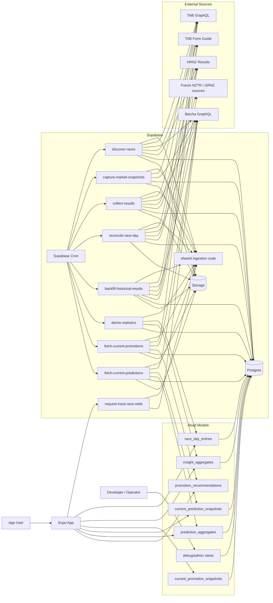
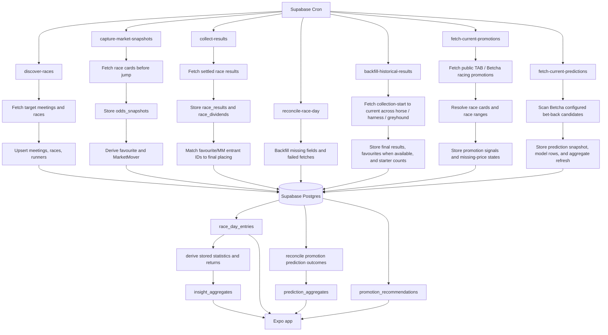
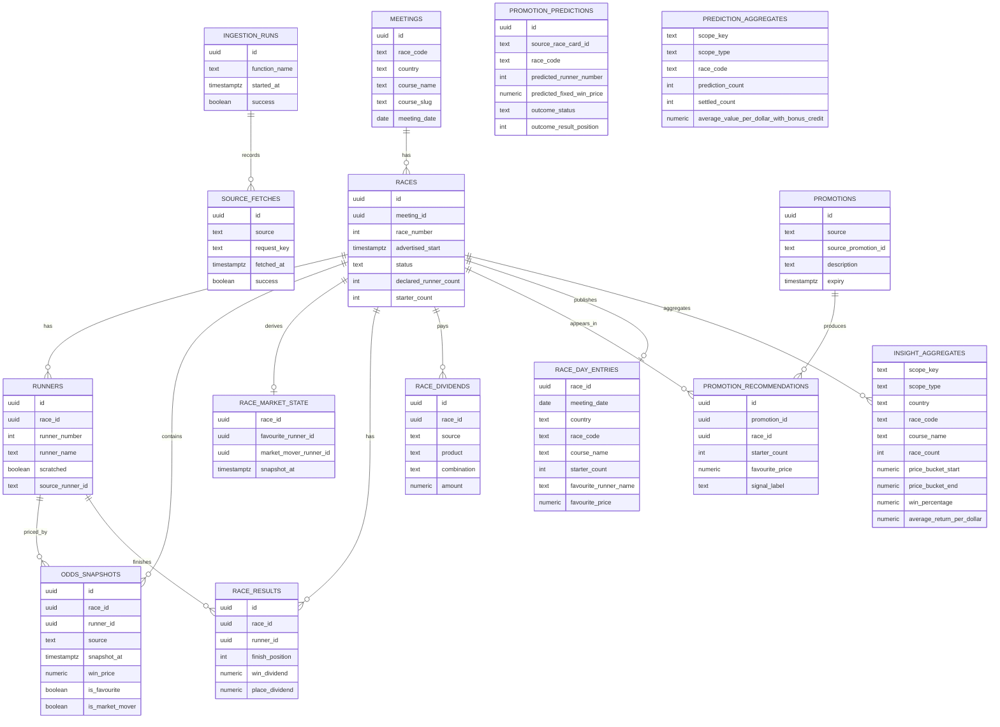

# Application Architecture

## Context

This diagram describes the MVP architecture for Feeling Gamba. The canonical
source for this architecture is:

- `docs/architecture/application-architecture.yaml`

The YAML file is intentionally plain and structured so a future Codex skill or
script can parse it and regenerate visual diagrams.

Note: the YAML was updated on 2026-07-01 for HK domestic-region prediction and
race-day coverage. It was previously updated on 2026-06-25 for the
`global_bucket_cash_price_only_v1` and
`global_bucket_cash_starter_only_v1` prediction variations. Rendered
architecture outputs should be regenerated from the YAML before being treated
as current. The source also describes the later track-wide Insights odds
request contract, so the rendered outputs remain stale until regenerated. The
2026-06-24 update added the daily overnight race-day refresh schedule that
keeps prediction outcomes settling. The 2026-06-23 update added model-aware
prediction tracking, independent current prediction refreshes,
distance/condition prediction scopes, the `country_code_distance_condition_v1`
model, and the `global_bucket_cash_blend_v1` /
`global_bucket_cash_even_blend_v1` cash-only bucket models.

Race-day ingestion scope is now all AUS/NZ/HK domestic-region `HORSE`,
`HARNESS`, and `GREYHOUND` meetings returned by the configured Betcha source. The older pilot
track list is retained for diagnostics and reproducing historical fixture runs,
not as the production collection boundary.

The first user-account slice uses Supabase Auth with Google OAuth. Expo stores
the Supabase session locally, opens Google sign-in with Expo AuthSession, and
exchanges the returned PKCE code through Supabase. The app redirect scheme is
`feelinggamba://auth/callback`; this URL must be allowed in Supabase Auth
redirect settings before native sign-in can complete.

## System View

## Data Flow

## Insight Country And Track Scope

Insights must support an all-country/all-track view, a selected-country view,
and an individual-track view inside the selected country for:

- `$1` favourite return by discipline.
- Starter-count breakdown.
- Favourite price breakdown.

Supabase `insight_aggregates` stores these metrics by scope. The app should read
stored aggregate rows rather than recalculating insight tables from bundled
fixtures or raw race rows at runtime. Country and course filters must query the
matching scoped aggregate rows so each scope has its own denominators instead of
filtering already-aggregated all-track rows.

Insights filter metadata should also read the smallest matching aggregate
scopes: `country` rows for country options, `course` rows for racecourse
options, and `race_code` rows for discipline options. The app should not scan
all `insight_aggregates` rows for metadata because broad PostgREST reads can be
row-capped before later alphabetic tracks or countries appear.

Cash-plus-bonus aggregates must apply starter-count eligibility before adding
bonus credit: 5-7 final starters credits 2nd only, 8+ final starters credits
2nd/3rd, and fewer than 5 final starters earns no place-style bonus credit
unless a source-backed promotion supplies more specific terms.

## Storage View

## Promotion And Prediction Flow

`fetch-current-promotions` is limited to source-backed promotion output:

- Source-backed TAB/Betcha race-specific promotion cards.

The Promos page hides broad racing offers that cannot be matched to race cards;
those offers remain in local fixture diagnostics only. Promotion source dates
are interpreted in `Pacific/Auckland`. The app checks Supabase
`current_promotion_snapshots` whenever the Promos tab is selected. Promotion
recommendations older than 15 minutes are treated as stale because live race
cards and fixed-win prices can change during the day. If
`EXPO_PUBLIC_PROMOTION_REFRESH_URL` points to the `refresh-current-promotions`
Supabase Edge Function, the app can request a fresh server-side promotion scan;
otherwise the Refresh button only re-checks the Supabase cache and operators
should run the local `fetch-current-promotions` worker. The Edge Function reads
historical promotion signal buckets from stored `insight_aggregates`, refreshes
public TAB/Betcha promotion data server-side, and upserts the generated payload
into `current_promotion_snapshots` with a server-side Supabase secret key. The
Promos screen has no bundled-data runtime fallback: missing Supabase
configuration, missing cache rows, and cache read errors are shown as explicit
unavailable states. Any bundled promotion fixture remains a development
diagnostic only and is not used by the app runtime.

`fetch-current-predictions` / `refresh-current-predictions` owns the current
Betcha candidate scan independently of promotions. It scans current Betcha race
cards for all NZ/AUS/HK domestic-region meetings returned by the source, derives the live
favourite from fixed-win prices, then ranks races within each country/discipline
group using the active prediction variation's model-specific `cashAverageScore`.
Cash-plus-bonus remains visible as supporting context, but it must not drive
recommendation ordering or status pills. The scan keeps at most the five best
candidates per country/discipline group so HK candidates are not hidden behind
larger NZ/AUS race volumes. It is a statistical signal only, with no stake
sizing, bankroll guidance, automated wagering, or invented favourites. Stored
prediction rows must be created only before the first eligible race in the
day's all-domestic NZ/AUS/HK prediction coverage has started.
The daily prediction refresh is scheduled through
`.github/workflows/current-prediction-refresh.yml` at `17:35` and `18:35` UTC,
with optional Supabase Cron backup using
`supabase/sql/schedule-refresh-current-predictions.sql`, so prediction data is
captured even when nobody opens the app. After the first advertised start,
`refresh-current-predictions` may return the same-day cached pre-race snapshot,
but it must not upsert a replacement `current_prediction_snapshots` row, write
`promotion_predictions`, or rebuild `prediction_aggregates`. This keeps model
performance comparable because each source date is measured from a full-card
pre-race decision point rather than a late-day subset of remaining races. The
app reads current candidates from `current_prediction_snapshots` for the current
Auckland source date and can call `EXPO_PUBLIC_PREDICTION_REFRESH_URL` to
request the `refresh-current-predictions` Edge Function. The worker also writes
model-scoped rows to `promotion_predictions`, keyed by
`(prediction_model, source, source_race_card_id)`, so multiple model variations
can run in parallel on the same race card even when no active promotion exists.
During the migration transition, if Supabase reports
`current_prediction_snapshots` is missing or the table exists but has no rows,
the app may temporarily read the latest `current_promotion_snapshots` payload
for candidate display and show a clear transition message. This fallback should
disappear from normal operation once the prediction snapshot table is deployed
and populated.
The first model remains `global_bucket_blend_v1`, which ranks current
favourites from all-country historical price-bucket and starter-count cash
averages using the same 65/35 price/starter weighting as the earlier bucket
blend.
The `global_bucket_cash_blend_v1` model uses the same 65/35 price-bucket and
starter-count weighting, but is named explicitly as cash-only and excludes
bonus-credit value. The `global_bucket_cash_even_blend_v1` model
also excludes bonus-credit value, but uses an even 50/50 price-bucket and
starter-count cash average blend. The `global_bucket_cash_price_only_v1` and
`global_bucket_cash_starter_only_v1` models isolate 100% favourite price-bucket
cash average and 100% final starter-count cash average respectively, excluding
bonus-credit value. The `global_other_starters_average_price_cash_v1` model
uses the cash average for the bucket matching the average fixed-win price of the
other priced starters, excluding other-starter prices at `$70.00` or above from
that average. This is the first field-shape signal; median other-starter fixed
win price remains a planned follow-up to reduce sensitivity to long-priced
outliers. The `country_code_bucket_blend_shrunk_v1` model uses country+discipline
price and starter buckets where available, shrunk toward matching global bucket
values to reduce small-sample noise. The
`country_code_distance_condition_v1` model blends country+discipline price,
starter-count, distance-band, and track-condition buckets with conservative
shrinkage toward broader history. A prediction row is replaced only when its
signature changes, covering material changes such as the predicted favourite,
fixed-win price, starter count, rank, model score, or signal. The daily
overnight `refresh-race-days-and-insights` invocation reconciles non-settled
predictions against the stored race, runner, and result rows, then rebuilds
model-scoped `prediction_aggregates` for the Predictions tab. Prediction
outcomes use the predicted runner and predicted fixed-win price, not the later
final favourite.

Because Expo runs from `apps/mobile`, `apps/mobile/app.config.js` loads the
repo-root public Supabase env values before Metro bundles the app.

## Runtime App Data Contract

- Race Days reads `race_day_entries` from Supabase. The default query should
  request the latest 20 races across all AUS/NZ/HK records. Auckland is used only
  as the calendar timezone when source timestamps need date conversion, not as a
  racecourse filter.
- Race Days filters should query Supabase for the selected date range, country,
  discipline, and course instead of filtering bundled all-data fixtures.
- Signed-in users can select saved favourite-track chips in Race Days; the chip
  applies the stored country, discipline, and course to the same Supabase
  `race_day_entries` query path.
- Insights reads stored rows from `insight_aggregates`; the app must not
  calculate the main historical insight tables from local fixtures at runtime.
  Insights filters include country, track, and discipline. When one track and
  one discipline are selected, the app can call `request-track-race-odds` to
  fetch current public Betcha odds for all races at the selected track, store
  an audit row in `track_race_odds_requests`, and show the response for manual
  comparison with account-visible hidden promos. The response includes the
  default `global_bucket_blend_v1` cash average score plus cash-plus-bonus
  context for each returned race.
- Signed-in users can select saved favourite-track chips in Insights; the chip
  applies the stored country, discipline, and track scope before reading
  `insight_aggregates`.
- Recommendations reads `current_promotion_snapshots` on tab selection for
  race-specific public promotion signals, treats cache rows older than 15
  minutes as stale, and can request a fresh server-side scan when
  `EXPO_PUBLIC_PROMOTION_REFRESH_URL` is configured. It later reads
  `promotion_recommendations` when the normalized promotion model is wired.
- Signed-in users can manually track visible promo race signals from
  Recommendations. The app writes one owner-secured `user_race_bets` row per
  user/bookmaker/source/race card and does not store real stake size. TAB and
  Betcha tracking are separate scopes.
- Account reads `user_favourite_tracks` and `user_race_bets` through owner-only
  RLS. It supports removing favourite tracks and tracked promo bets, and it
  calculates bookmaker-scoped personal unit-return statistics from settled
  tracked rows only.
- Account also reads `user_balance_accounts` and `user_balance_events` through
  owner-only RLS. Signed-in users can set one initial manual balance, record
  deposits and withdrawals, add manual balance updates, and view the resulting
  balance history line graph. The balance ledger must remain manual tracking
  only and must not feed stake sizing, bankroll guidance, or automated wagering.
- Predictions reads current bet candidates from the latest
  `current_prediction_snapshots` payload, stored model-filtered rows from
  `prediction_aggregates` for performance metrics, and recent model-filtered
  `promotion_predictions` rows for itemised race history. The screen presents
  prediction variations as tabs and shows a concise model-method explanation at
  the top of each variation. The history filters query Supabase by date range,
  country, discipline, and racecourse. The app must not calculate prediction
  performance from raw prediction rows at runtime.
- Daily overnight `refresh-race-days-and-insights` reconciles pending
  `user_race_bets` by `source_race_card_id` and selected runner number after
  race results are refreshed.
- Normalized race/source tables and operational tables remain server-side behind
  RLS. Public client reads are limited to app-facing read models and public
  promotion snapshots.

## Skill Direction

A future `architecture-diagram-renderer` skill should read
`application-architecture.yaml`, validate the expected sections, and generate
Mermaid, SVG, or PNG outputs. The skill should treat the YAML as the source of
truth and any rendered diagram as generated output.
