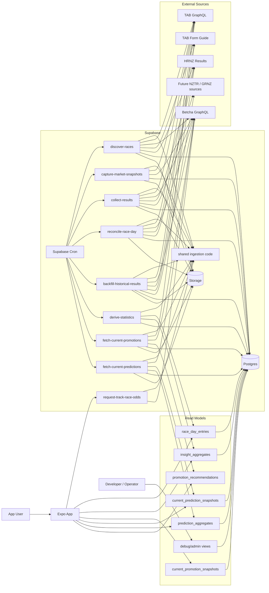
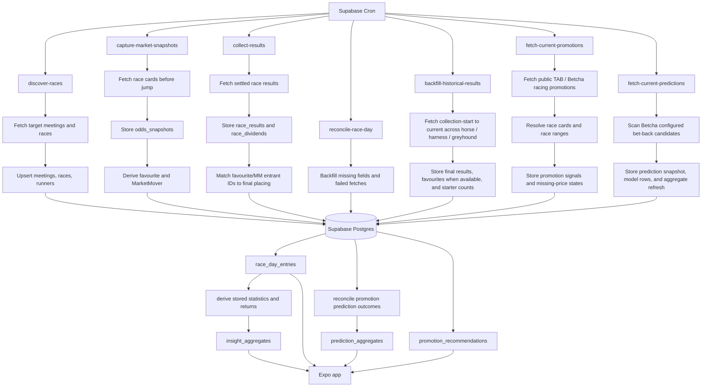
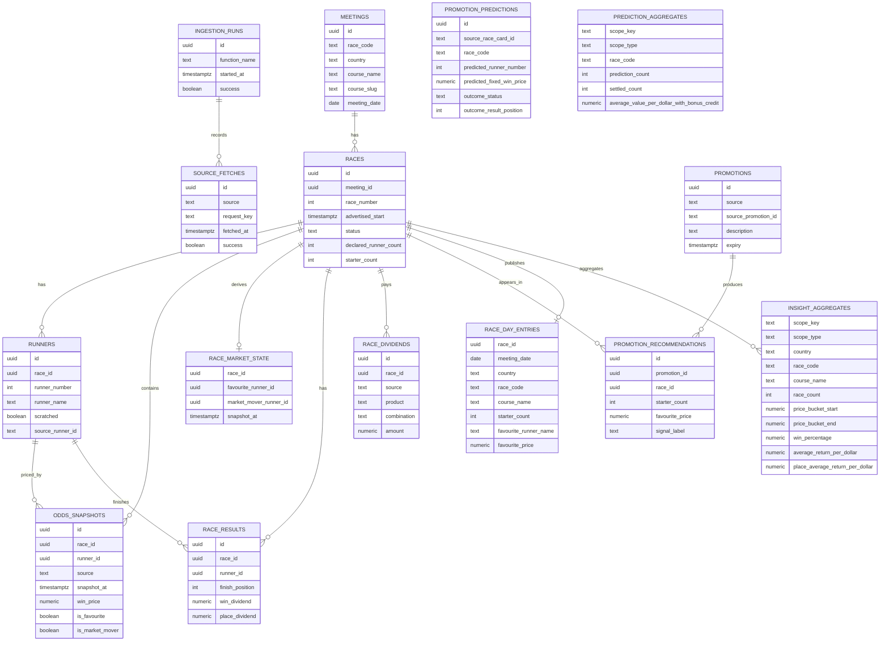

# Application Architecture

## Context

This diagram describes the MVP architecture for Feeling Gamba. The canonical
source for this architecture is:

- `docs/architecture/application-architecture.yaml`

The YAML file is intentionally plain and structured so a future Codex skill or
script can parse it and regenerate visual diagrams.

Note: the YAML was updated on 2026-07-24 for the
`multi_win_percentage_60_plus_v1` and `multi_place_percentage_v1` tracked
models. It was previously updated on 2026-07-23 for the
`multi_win_percentage_65_plus_v1` tracked model, Prediction History model
selector split, and a deferred Supabase region-migration improvement. It was
previously updated on 2026-07-17 for signed-in
win-percentage multi
recommendation locks and rank-filtered win-percentage multi-bet performance,
on 2026-07-09 for the dedicated win-percentage multi-bet model, on 2026-07-07
for cash-only favourite place-return discipline metrics in Insights, on
2026-07-04 for tracked cash-only multi bet recommendation outcomes, on
2026-07-03 for the Predictions history date-range breakdown, on 2026-07-02 for
the Predictions multi bet recommendation panel, and on 2026-07-01 for HK
domestic-region prediction and race-day coverage. It
was previously updated on 2026-06-25 for the
`global_bucket_cash_price_only_v1` and
`global_bucket_cash_starter_only_v1` prediction variations. Rendered
architecture outputs should be regenerated from the YAML before being treated
as current. The source also describes the later track-wide Insights odds
request contract, so the rendered outputs remain stale until regenerated. The
2026-06-24 update added the daily overnight race-day refresh schedule that
keeps prediction outcomes settling. The 2026-06-23 update added model-aware
prediction tracking, independent current prediction refreshes,
distance/condition prediction scopes, the `country_code_distance_condition_v1`
model, and the `global_bucket_cash_blend_v1` /
`global_bucket_cash_even_blend_v1` cash-only bucket models.

Race-day ingestion scope is now all AUS/NZ/HK domestic-region `HORSE`,
`HARNESS`, and `GREYHOUND` meetings returned by the configured Betcha source. The older pilot
track list is retained for diagnostics and reproducing historical fixture runs,
not as the production collection boundary.

The first user-account slice uses Supabase Auth with Google OAuth. Expo stores
the Supabase session locally, opens Google sign-in with Expo AuthSession, and
exchanges the returned PKCE code through Supabase. The app redirect scheme is
`feelinggamba://auth/callback`; this URL must be allowed in Supabase Auth
redirect settings before native sign-in can complete.

## System View

```mermaid
flowchart LR
  app[Expo App]
  user[App User]
  operator[Developer / Operator]

  subgraph supabase[Supabase]
    cron[Supabase Cron]
    db[(Postgres)]
    storage[(Storage)]
    discover[discover-races]
    market[capture-market-snapshots]
    results[collect-results]
    reconcile[reconcile-race-day]
    backfill[backfill-historical-results]
    statsJob[derive-statistics]
    promos[fetch-current-promotions]
    predictions[fetch-current-predictions]
    trackOdds[request-track-race-odds]
    shared[shared ingestion code]
  end

  subgraph views[Read Models]
    raceDayView[race_day_entries]
    insightView[insight_aggregates]
    promoCache[current_promotion_snapshots]
    predictionCache[current_prediction_snapshots]
    predictionView[prediction_aggregates]
    promoView[promotion_recommendations]
    debugViews[debug/admin views]
  end

  subgraph sources[External Sources]
    tab[TAB GraphQL]
    betcha[Betcha GraphQL]
    formGuide[TAB Form Guide]
    hrnz[HRNZ Results]
    official[Future NZTR / GRNZ sources]
  end

  user --> app
  app --> raceDayView
  app --> insightView
  app --> trackOdds
  app --> promoCache
  app --> predictionCache
  app --> predictionView
  raceDayView --> db
  insightView --> db
  promoCache --> db
  predictionCache --> db
  predictionView --> db

  operator --> debugViews
  debugViews --> db

  cron --> discover
  cron --> market
  cron --> results
  cron --> reconcile
  cron --> backfill
  cron --> statsJob
  cron --> promos
  cron --> predictions

  discover --> shared
  market --> shared
  results --> shared
  reconcile --> shared
  backfill --> shared
  statsJob --> shared
  promos --> shared
  predictions --> shared
  trackOdds --> shared

  discover --> tab
  discover --> betcha
  discover --> formGuide
  discover --> hrnz

  market --> tab
  market --> betcha
  trackOdds --> betcha

  results --> tab
  results --> betcha
  results --> hrnz
  results --> official

  reconcile --> tab
  reconcile --> betcha
  reconcile --> formGuide
  reconcile --> hrnz
  backfill --> tab
  backfill --> betcha
  backfill --> formGuide
  backfill --> hrnz
  backfill --> official
  promos --> tab
  promos --> betcha
  predictions --> betcha

  statsJob --> raceDayView
  statsJob --> insightView
  promos --> promoView
  predictions --> predictionCache
  predictions --> predictionView

  discover --> db
  market --> db
  results --> db
  reconcile --> db
  backfill --> db
  statsJob --> db
  promos --> db
  predictions --> db

  discover --> storage
  market --> storage
  results --> storage
  reconcile --> storage
  backfill --> storage
  promos --> storage
  predictions --> storage

  app --> promoView
```

## Data Flow

```mermaid
flowchart TD
  A[Supabase Cron] --> B[discover-races]
  B --> C[Fetch target meetings and races]
  C --> D[Upsert meetings, races, runners]
  D --> E[(Supabase Postgres)]

  A --> F[capture-market-snapshots]
  F --> G[Fetch race cards before jump]
  G --> H[Store odds_snapshots]
  H --> I[Derive favourite and MarketMover]
  I --> E

  A --> J[collect-results]
  J --> K[Fetch settled race results]
  K --> L[Store race_results and race_dividends]
  L --> M[Match favourite/MM entrant IDs to final placing]
  M --> E

  A --> N[reconcile-race-day]
  N --> O[Backfill missing fields and failed fetches]
  O --> E

  A --> R[backfill-historical-results]
  R --> S[Fetch collection-start to current across horse / harness / greyhound]
  S --> T[Store final results, favourites when available, and starter counts]
  T --> E

  A --> AA[fetch-current-promotions]
  AA --> AB[Fetch public TAB / Betcha racing promotions]
  AB --> AC[Resolve race cards and race ranges]
  AC --> AD[Store promotion signals and missing-price states]
  AD --> E

  A --> AE[fetch-current-predictions]
  AE --> AF[Scan Betcha configured bet-back candidates]
  AF --> AG[Store prediction snapshot, model rows, and aggregate refresh]
  AG --> E

  E --> P[race_day_entries]
  P --> U[derive stored statistics and returns]
  U --> V[insight_aggregates]
  E --> W[reconcile promotion prediction outcomes]
  W --> X[prediction_aggregates]
  E --> Y[promotion_recommendations]
  V --> Q[Expo app]
  X --> Q
  Y --> Q
  P --> Q
```

## Insight Country And Track Scope

Insights must support an all-country/all-track view, a selected-country view,
and an individual-track view inside the selected country for:

- `$1` favourite return by discipline.
- Cash-only `$1` favourite place return by discipline.
- Starter-count breakdown.
- Favourite price breakdown.

Supabase `insight_aggregates` stores these metrics by scope. The app should read
stored aggregate rows rather than recalculating insight tables from bundled
fixtures or raw race rows at runtime. Country and course filters must query the
matching scoped aggregate rows so each scope has its own denominators instead of
filtering already-aggregated all-track rows.

Insights filter metadata should also read the smallest matching aggregate
scopes: `country` rows for country options, `course` rows for racecourse
options, and `race_code` rows for discipline options. The app should not scan
all `insight_aggregates` rows for metadata because broad PostgREST reads can be
row-capped before later alphabetic tracks or countries appear.

Cash-plus-bonus aggregates must apply starter-count eligibility before adding
bonus credit: 5-7 final starters credits 2nd only, 8+ final starters credits
2nd/3rd, and fewer than 5 final starters earns no place-style bonus credit
unless a source-backed promotion supplies more specific terms.

Favourite place-return aggregates are separate from bonus-credit aggregates.
They stake `$1` only when the final starter count has a source-backed place
market depth: AU/NZ count 5-7 starters for top 2 and 8+ for top 3, while HK
counts 4-6 starters for top 2 and 7+ for top 3. Place returns use stored fixed
place dividends and expose cash stake, cash return, cash average, cash net,
cash ROI, hit rate, and missing place-dividend counts.

## Storage View

```mermaid
erDiagram
  MEETINGS ||--o{ RACES : has
  RACES ||--o{ RUNNERS : has
  RUNNERS ||--o{ ODDS_SNAPSHOTS : priced_by
  RACES ||--o{ ODDS_SNAPSHOTS : contains
  RACES ||--o| RACE_MARKET_STATE : derives
  RUNNERS ||--o{ RACE_RESULTS : finishes
  RACES ||--o{ RACE_RESULTS : has
  RACES ||--o{ RACE_DIVIDENDS : pays
  INGESTION_RUNS ||--o{ SOURCE_FETCHES : records
  PROMOTIONS ||--o{ PROMOTION_RECOMMENDATIONS : produces
  RACES ||--o{ PROMOTION_RECOMMENDATIONS : appears_in
  RACES ||--o| RACE_DAY_ENTRIES : publishes
  RACES ||--o{ INSIGHT_AGGREGATES : aggregates

  MEETINGS {
    uuid id
    text race_code
    text country
    text course_name
    text course_slug
    date meeting_date
  }

  RACES {
    uuid id
    uuid meeting_id
    int race_number
    timestamptz advertised_start
    text status
    int declared_runner_count
    int starter_count
  }

  RUNNERS {
    uuid id
    uuid race_id
    int runner_number
    text runner_name
    boolean scratched
    text source_runner_id
  }

  ODDS_SNAPSHOTS {
    uuid id
    uuid race_id
    uuid runner_id
    text source
    timestamptz snapshot_at
    numeric win_price
    boolean is_favourite
    boolean is_market_mover
  }

  RACE_MARKET_STATE {
    uuid race_id
    uuid favourite_runner_id
    uuid market_mover_runner_id
    timestamptz snapshot_at
  }

  RACE_RESULTS {
    uuid id
    uuid race_id
    uuid runner_id
    int finish_position
    numeric win_dividend
    numeric place_dividend
  }

  RACE_DIVIDENDS {
    uuid id
    uuid race_id
    text source
    text product
    text combination
    numeric amount
  }

  SOURCE_FETCHES {
    uuid id
    text source
    text request_key
    timestamptz fetched_at
    boolean success
  }

  INGESTION_RUNS {
    uuid id
    text function_name
    timestamptz started_at
    boolean success
  }

  PROMOTIONS {
    uuid id
    text source
    text source_promotion_id
    text description
    timestamptz expiry
  }

  PROMOTION_RECOMMENDATIONS {
    uuid id
    uuid promotion_id
    uuid race_id
    int starter_count
    numeric favourite_price
    text signal_label
  }

  PROMOTION_PREDICTIONS {
    uuid id
    text source_race_card_id
    text race_code
    int predicted_runner_number
    numeric predicted_fixed_win_price
    text outcome_status
    int outcome_result_position
  }

  RACE_DAY_ENTRIES {
    uuid race_id
    date meeting_date
    text country
    text race_code
    text course_name
    int starter_count
    text favourite_runner_name
    numeric favourite_price
  }

  INSIGHT_AGGREGATES {
    text scope_key
    text scope_type
    text country
    text race_code
    text course_name
    int race_count
    numeric price_bucket_start
    numeric price_bucket_end
    numeric win_percentage
    numeric average_return_per_dollar
    numeric place_average_return_per_dollar
  }

  PREDICTION_AGGREGATES {
    text scope_key
    text scope_type
    text race_code
    int prediction_count
    int settled_count
    numeric average_value_per_dollar_with_bonus_credit
  }
```

## Promotion And Prediction Flow

`fetch-current-promotions` is limited to source-backed promotion output:

- Source-backed TAB/Betcha race-specific promotion cards.

The Promos page hides broad racing offers that cannot be matched to race cards;
those offers remain in local fixture diagnostics only. Promotion source dates
are interpreted in `Pacific/Auckland`. The app checks Supabase
`current_promotion_snapshots` whenever the Promos tab is selected. Promotion
recommendations older than 15 minutes are treated as stale because live race
cards and fixed-win prices can change during the day. If
`EXPO_PUBLIC_PROMOTION_REFRESH_URL` points to the `refresh-current-promotions`
Supabase Edge Function, the app can request a fresh server-side promotion scan;
otherwise the Refresh button only re-checks the Supabase cache and operators
should run the local `fetch-current-promotions` worker. The Edge Function reads
historical promotion signal buckets from stored `insight_aggregates`, refreshes
public TAB/Betcha promotion data server-side, and upserts the generated payload
into `current_promotion_snapshots` with a server-side Supabase secret key. The
Promos screen has no bundled-data runtime fallback: missing Supabase
configuration, missing cache rows, and cache read errors are shown as explicit
unavailable states. Any bundled promotion fixture remains a development
diagnostic only and is not used by the app runtime.

`fetch-current-predictions` / `refresh-current-predictions` owns the current
Betcha candidate scan independently of promotions. It scans current Betcha race
cards for all NZ/AUS/HK domestic-region meetings returned by the source, derives the live
favourite from fixed-win prices, then ranks races within each country/discipline
group using the active prediction variation's model-specific `cashAverageScore`.
Cash-plus-bonus remains visible as supporting context, but it must not drive
recommendation ordering or status pills. The scan keeps at most the five best
candidates per country/discipline group so HK candidates are not hidden behind
larger NZ/AUS race volumes. The scan excludes source races marked abandoned or
cancelled by the racing-day listing or race-card status before ranking
candidates or building multi-bet recommendations. It also attaches a separate
placing signal to each current candidate from stored place-rate insight
aggregates, using country-aware place-market depth: AU/NZ 5-7 starters pays top
2 and 8+ pays top 3; HK 4-6 pays top 2 and 7+ pays top 3. It is a statistical signal
only, with no stake sizing, bankroll guidance, automated wagering, or invented
favourites. Stored prediction rows must be created only before the first
eligible race in the day's all-domestic NZ/AUS/HK prediction coverage has
started.
The daily prediction refresh is scheduled through
`.github/workflows/current-prediction-refresh.yml` at `17:35` and `18:35` UTC,
with optional Supabase Cron backup using
`supabase/sql/schedule-refresh-current-predictions.sql`, so prediction data is
captured even when nobody opens the app. After the first advertised start,
`refresh-current-predictions` may return the same-day cached pre-race snapshot,
but it must not upsert a replacement `current_prediction_snapshots` row, write
`promotion_predictions`, or rebuild `prediction_aggregates`. This keeps model
performance comparable because each source date is measured from a full-card
pre-race decision point rather than a late-day subset of remaining races. The
scheduled GitHub Actions workflow calls `refresh-current-predictions`
separately for `sport: "racing"` and `sport: "ufc"` so a slow source scan for
one sport does not consume the whole Edge request idle-timeout budget. The
racing scan fetches Betcha race-card details with bounded concurrency instead
of one card at a time.
app reads current candidates from `current_prediction_snapshots` for the current
Auckland source date and can call `EXPO_PUBLIC_PREDICTION_REFRESH_URL` to
request the `refresh-current-predictions` Edge Function. If the stored snapshot's
prediction window is already closed, the app should render that cached pre-race
snapshot immediately and skip stale-refresh attempts, because the backend cannot
replace the snapshot after the first eligible race has started. The worker also writes
model-scoped rows to `promotion_predictions`, keyed by
`(prediction_model, source, source_race_card_id)`, so multiple model variations
can run in parallel on the same race card even when no active promotion exists.
During the migration transition, if Supabase reports
`current_prediction_snapshots` is missing or the table exists but has no rows,
the app may temporarily read the latest `current_promotion_snapshots` payload
for candidate display and show a clear transition message. This fallback should
disappear from normal operation once the prediction snapshot table is deployed
and populated.
The prediction refresh also stores one tracked multi bet recommendation per
model/source date when enough eligible legs exist. Cash-score multis are keyed
to the selected single-runner prediction models. Dedicated win-percentage
multi-only models are tracked separately and score current favourites from
historical win percentages using 65% favourite price-bucket win rate and 35%
starter-count win rate. The original `multi_win_percentage_blend_v1` model
keeps the existing Positive-first, then Positive-or-Neutral, three-to-five-leg
rule. The stricter `multi_win_percentage_60_plus_v1` and
`multi_win_percentage_65_plus_v1` models store only priced legs with blended
win scores of at least 60% and 65% respectively, require at least three legs,
and can keep up to 10 legs. The `multi_place_percentage_v1` model also appears
under Win % multis, ranks favourites by blended historical place percentage,
requires an active place market, requires at least three legs, and can keep up
to eight legs. Win-based tracked multis settle as a cash win only when every
leg wins. The place-percentage multi stores fixed-place leg odds and the
combined fixed-place price, then settles as a cash return only when every
selected leg finishes inside the stored place payout depth. No bonus-bet value,
stake sizing, bankroll guidance, or
automated wagering is stored or displayed for tracked multis.
The first model remains `global_bucket_blend_v1`, which ranks current
favourites from all-country historical price-bucket and starter-count cash
averages using the same 65/35 price/starter weighting as the earlier bucket
blend.
The `global_bucket_cash_blend_v1` model uses the same 65/35 price-bucket and
starter-count weighting, but is named explicitly as cash-only and excludes
bonus-credit value. The `global_bucket_cash_even_blend_v1` model
also excludes bonus-credit value, but uses an even 50/50 price-bucket and
starter-count cash average blend. The `global_bucket_cash_price_only_v1` and
`global_bucket_cash_starter_only_v1` models isolate 100% favourite price-bucket
cash average and 100% final starter-count cash average respectively, excluding
bonus-credit value. The `global_other_starters_average_price_cash_v1` model
uses the cash average for the bucket matching the average fixed-win price of the
other priced starters, excluding other-starter prices at `$70.00` or above from
that average. This is the first field-shape signal; median other-starter fixed
win price remains a planned follow-up to reduce sensitivity to long-priced
outliers. The `country_code_bucket_blend_shrunk_v1` model uses country+discipline
price and starter buckets where available, shrunk toward matching global bucket
values to reduce small-sample noise. The
`country_code_distance_condition_v1` model blends country+discipline price,
starter-count, distance-band, and track-condition buckets with conservative
shrinkage toward broader history. A prediction row is replaced only when its
signature changes, covering material changes such as the predicted favourite,
fixed-win price, starter count, rank, model score, or signal. The daily
overnight `refresh-race-days-and-insights` workflow reconciles non-settled
predictions against the stored race, runner, and result rows in a dedicated
final request, then rebuilds model-scoped `prediction_aggregates` for the
Predictions tab in a separate final request so those jobs do not share one Edge
Function idle-timeout window. Prediction outcomes use the predicted runner and
predicted fixed-win price, not the later final favourite.

Because Expo runs from `apps/mobile`, `apps/mobile/app.config.js` loads the
repo-root public Supabase env values before Metro bundles the app.

## Runtime App Data Contract

- Race Days reads `race_day_entries` from Supabase. The default query should
  request the latest 20 races across all AUS/NZ/HK records. Auckland is used only
  as the calendar timezone when source timestamps need date conversion, not as a
  racecourse filter.
- Race Days filters should query Supabase for the selected date range, country,
  discipline, and course instead of filtering bundled all-data fixtures.
- Historical Data includes a Model backtests view. For now it mirrors the
  Prediction History control hierarchy with one History type (`Win % multis`),
  sport-scoped model tabs, win percentage multi rank filters, and an all-time
  aggregate Multi-bet win percentage performance panel. The app reads
  `get_historical_multi_backtest_summary`, which recalculates each historical
  multi from `historical_multi_backtest_legs` for the selected rank filter, so
  historical "would have recommended" analysis remains separate from live
  Prediction History.
- Signed-in users can select saved favourite-track chips in Race Days; the chip
  applies the stored country, discipline, and course to the same Supabase
  `race_day_entries` query path.
- Insights reads stored rows from `insight_aggregates`; the app must not
  calculate the main historical insight tables from local fixtures at runtime.
  Insights filters include country, track, and discipline. When one track and
  one discipline are selected, the app can call `request-track-race-odds` to
  fetch current public Betcha odds for all races at the selected track, store
  an audit row in `track_race_odds_requests`, and show the response for manual
  comparison with account-visible hidden promos. The response includes the
  default `global_bucket_blend_v1` cash average score plus cash-plus-bonus
  context for each returned race.
- Signed-in users can select saved favourite-track chips in Insights; the chip
  applies the stored country, discipline, and track scope before reading
  `insight_aggregates`.
- Recommendations reads `current_promotion_snapshots` on tab selection for
  race-specific public promotion signals, treats cache rows older than 15
  minutes as stale, and can request a fresh server-side scan when
  `EXPO_PUBLIC_PROMOTION_REFRESH_URL` is configured. It later reads
  `promotion_recommendations` when the normalized promotion model is wired.
- Signed-in users can manually track visible promo race signals from
  Recommendations. The app writes one owner-secured `user_race_bets` row per
  user/bookmaker/source/race card and does not store real stake size. TAB and
  Betcha tracking are separate scopes.
- Account reads `user_favourite_tracks` and `user_race_bets` through owner-only
  RLS. It supports removing favourite tracks and tracked promo bets, and it
  calculates bookmaker-scoped personal unit-return statistics from settled
  tracked rows only.
- Account also reads `user_balance_accounts` and `user_balance_events` through
  owner-only RLS. Signed-in users can set one initial manual balance, record
  deposits and withdrawals, add manual balance updates, and view the resulting
  balance history line graph. The balance ledger must remain manual tracking
  only and must not feed stake sizing, bankroll guidance, or automated wagering.
- Predictions reads `user_locked_multi_recommendations` through owner-only RLS
  for signed-in users. Before 10:00am NZ time, a user can lock the selected
  percentage multi recommendation model for the current source date; after
  that, the screen displays the locked snapshot even if the live prediction
  snapshot refreshes to a different recommendation.
- Predictions reads `user_locked_ufc_multi_recommendations` through owner-only
  RLS for UFC percentage multi models. UFC locks are keyed by source date,
  Betcha UFC card, and model, and close at the stored card-level cutoff just
  before the first fight rather than the racing 10:00am cutoff.
- Predictions reads current candidates from the latest
  `current_prediction_snapshots` payload behind a sport selector. Racing shows
  Cash, Win %, and Placing prediction types: Cash shows the selected
  single-runner model and active-model multi, Win % shows the selected racing
  percentage multi-only model, and Placing shows current place-rate signals.
  UFC shows only UFC Win % multi models for now, reading current Betcha UFC Head
  to Head fight-card payloads from the same snapshot and listing only
  same-card multis.
- The app can call `refresh-current-predictions` with a sport-scoped JSON body.
  `{ "sport": "ufc" }` refreshes only UFC aggregates/current Betcha fight
  cards, updates the UFC part of `current_prediction_snapshots`, and writes UFC
  multi recommendation rows without touching racing prediction rows or racing
  aggregates. UFC-scoped refreshes update UFC-specific freshness fields while
  preserving the top-level racing snapshot freshness timestamp. `{ "sport":
  "racing" }` refreshes only racing predictions and preserves the existing UFC
  snapshot data. Refresh workers write normalized prediction rows, tracked
  multi recommendation rows, and aggregate rebuilds before updating
  `current_prediction_snapshots`; this keeps the current Predictions tab and
  Prediction History on the same generated payload. If a past current snapshot
  was written without matching tracked rows, operators can replay it with
  `npm --workspace @feeling-gamba/ingestion run repair:prediction-snapshot -- --source-date=YYYY-MM-DD --require-supabase`.
  If the racing scan touches source races but every race-card detail request
  fails, the worker treats that as a source failure and skips racing snapshot,
  prediction-row, and multi-row writes instead of replacing a usable current
  snapshot with an empty candidate payload.
- Prediction History reads stored model-filtered rows from
  `prediction_aggregates` for performance metrics and recent model-filtered
  `promotion_predictions` rows for itemised race history. It also reads tracked
  multi bet recommendations and their legs from `multi_bet_recommendations` /
  `multi_bet_recommendation_legs` through cash-only summary and history RPCs,
  including stored fixed-place odds for place-percentage multi returns.
  UFC percentage multi models read `ufc_multi_recommendations` /
  `ufc_multi_recommendation_legs` through UFC-specific summary and history RPCs.
  Sport is selected first. Racing then shows the history type selector and the
  relevant model selector below it: single-runner prediction models for
  singles, cash multis, and placing; racing percentage multi-only models for
  Win % multis. UFC history shows UFC Win % multis and UFC model selectors only.
  Win % multi history can apply all-legs or top-N rank filters against stored
  leg ranks. `multi_win_percentage_blend_v1` supports top 3-5,
  `multi_win_percentage_60_plus_v1` and `multi_win_percentage_65_plus_v1`
  support top 3-10, `multi_place_percentage_v1` supports top 3-8, and UFC
  percentage multi models support top 3-8 while hiding racing-only country,
  discipline, and racecourse filters.
  The screen presents prediction variations as tabs, tags tabs that have
  tracked multi-bet prediction rows for the current Auckland source date, and
  shows a concise model-method explanation at the top of each variation.
  The history filters query Supabase by date range, country,
  discipline, and racecourse, defaulting and resetting the date range to
  yesterday in `Pacific/Auckland` time. Multi history filters match
  recommendations that include at least one leg in the selected
  country/discipline/racecourse because a multi can contain mixed legs. The
  screen also calls the multi summary RPC without date filters to show all-time
  tracked multi recommendation totals for the active model inside Stored model
  performance. The selected history date range is summarised through a server-side
  `get_prediction_history_summary` RPC over all matching rows so the paginated
  visible list is not used as an aggregate denominator. Itemised history rows
  are read through
  `get_prediction_history_entries`, which orders wins, 2nd, 3rd, then losses
  before applying the visible row limit. During migration rollout, if that RPC
  is not yet exposed by PostgREST, the app may temporarily fall back to a direct
  `promotion_predictions` read ordered by result position. The app must not
  calculate prediction performance from raw prediction rows at runtime.
- Daily overnight `refresh-race-days-and-insights` reconciles pending
  `user_race_bets` and tracked multi bet recommendation legs by
  `source_race_card_id` and selected runner number after race results are
  refreshed, using separate final requests for each reconciliation family.
- The same overnight refresh rebuilds `insight_aggregates` from stored
  `race_day_entries` after the source slices finish. That rebuild runs locally
  in the GitHub Actions runner, pages historical race rows, and accumulates
  aggregate buckets incrementally so the all-history insight job is outside the
  Supabase Edge worker CPU budget.
- The same reconciliation family also checks UFC multi recommendation legs
  against stored `ufc_fight_entries` result rows by source-backed fighter pair
  and event-date window. Settled UFC matches update leg winners and parent multi
  `$1` returns; unmatched UFC legs more than four hours after advertised start
  are marked `missing_result` so Prediction History shows an open issue rather
  than an active pending event.
- Normalized race/source tables and operational tables remain server-side behind
  RLS. Public client reads are limited to app-facing read models and public
  promotion snapshots.

## Future Infrastructure Improvements

- Supabase region migration is deferred as of 2026-07-23. The current primary
  Supabase project is hosted in Northeast Asia; if NZ/AU latency becomes
  material, create a new Supabase project in a closer region such as Sydney or
  Singapore and migrate rather than expecting an in-place region switch.
- A region migration must include schema migrations and data copy, Auth/provider
  configuration, Edge Function secrets and deployments, scheduled refresh jobs,
  GitHub/app environment variables, and a short write-freeze/final-sync/cutover
  window.

## Skill Direction

A future `architecture-diagram-renderer` skill should read
`application-architecture.yaml`, validate the expected sections, and generate
Mermaid, SVG, or PNG outputs. The skill should treat the YAML as the source of
truth and any rendered diagram as generated output.
