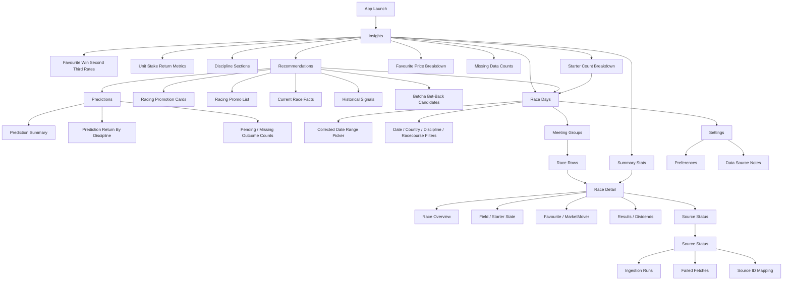
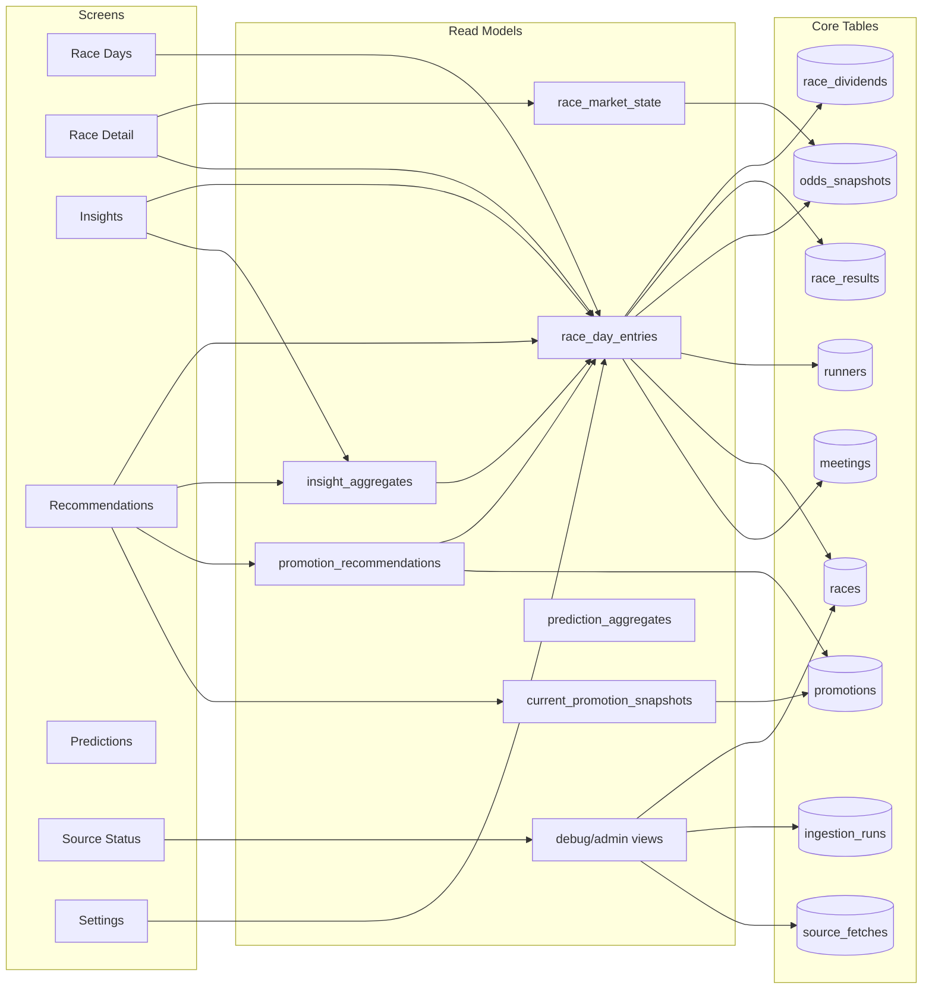

# Information Architecture

## Context

This document defines the MVP information architecture for the Feeling Gamba
Expo app. The app should help users browse recorded race outcomes, review
source-backed promotion signals, and help a developer/operator understand
whether ingestion is healthy.

The canonical structured source for this IA is:

- `docs/architecture/information-architecture.yaml`

The rendered visual representation is:

- `docs/architecture/information-architecture.html`
- `docs/architecture/information-architecture.png`
- `docs/architecture/information-architecture.jpg`

Note: the YAML was updated on 2026-06-25 for the two cash-only prediction
variations that isolate 100% price-bucket and 100% starter-count scoring.
Rendered IA outputs should be regenerated from the YAML before being treated as
current.

## Principles

- Start with logged race data and source-backed promotion facts, not stake advice.
- Make country, date, discipline, and racecourse the primary browsing controls.
- Show missing market/result data explicitly rather than inventing values.
- Keep source/debug information available without making it the main user flow.
- Treat Australian coverage as visible comparison data in Race Days, Insights,
  and bet-back candidate scans, with country labels available in app filters.
- Use Supabase app-facing read models for runtime race and insight data; local
  fixtures are development/backfill inputs only.
- Race Days and Insights course filters should be populated from Supabase rows
  produced by all-domestic AUS/NZ race-day ingestion, not from a hardcoded app
  track list.
- User-specific features should start behind Supabase Auth with Google sign-in,
  then add row-level-secured favourite tracks and personal race logs.

## Primary Navigation

### Race Days

Secondary browsing screen for the MVP. Race Days is useful for historical
inspection but should not be the default app landing page.

Purpose:

- Browse races by date.
- Filter by collected date range, country, discipline, and racecourse.
- Compare declared field size, final starter count, favourite, MarketMover,
  result, and payout/dividend data.
- Load the latest 20 races across AUS/NZ by default and query Supabase for
  filtered sets when the user changes date, country, discipline, or course.

Main content:

- Date range picker bounded to collected race dates.
- Default latest-20-race Supabase result set across AUS/NZ.
- Country filter: all countries, NZ, AUS.
- Discipline filter: horse, harness, greyhound.
- Racecourse filter scoped by the selected country.
- Saved-track quick filter for signed-in users, applying country, discipline,
  and racecourse in one action.
- Favourite-track save/remove control when one country, discipline, and
  racecourse are selected.
- Race list grouped by meeting/track.
- Empty and partial-data states.

Entry points:

- Main navigation from Insights.
- Date changes.
- Filters from Insights.

### Race Detail

Purpose:

- Explain one race outcome clearly.
- Show how favourite and MarketMover were selected.
- Show final results and dividends.

Main content:

- Race summary: track, race number, race name, start time, code, status.
- Field summary: declared runners, starters, scratchings.
- Market summary: selected favourite, MarketMover, snapshot timestamp, source.
- Result summary: winner, favourite placing, MarketMover placing, dividends.
- Runner table: runner number, name, scratched state, price, favourite/MM flags,
  finish position, win/place dividends.
- Source status: successful and failed fetches relevant to this race.

Entry points:

- Race list row.
- Favourite or MarketMover summary row from Insights.
- Operator/debug source mapping.

### Account

Purpose:

- Sign in with Google through Supabase Auth.
- Show the current signed-in email or display name.
- Sign out of the persisted Supabase session.
- Manage saved favourite tracks.
- Review manually tracked promo-bet performance.

Main content:

- Google sign-in action.
- Signed-in identity.
- Sign-out action.
- Favourite-track list with remove actions.
- Tracked promo-bet summary: logged count, settled count, pending count, and
  missing-outcome count.
- TAB/Betcha scope toggle for tracked promo-bet history and statistics.
- Tracked promo-bet return by discipline: cash average, cash net, bonus
  average, cash-plus-bonus average, cash-plus-bonus net, and ROI, calculated
  from settled rows only.
- Recent tracked promo-bet list with remove actions.
- Auth error state.

Auth notes:

- Expo uses the custom redirect scheme `feelinggamba://auth/callback`.
- Supabase Auth must allow that redirect URL in addition to local web URLs used
  during Expo web testing.

### Insights

Purpose:

- Act as the default app landing page for the MVP.
- Provide basic performance summaries without making predictions or
  recommendations.
- Show favourite-performance statistics across the collected historical dataset
  for thoroughbred, harness, and greyhound races.
- Break favourite finish-position rates down by final starter count.
- Break favourite win percentage down by 50c fixed-win price bucket.
- Show notional `$1` favourite return metrics by racing discipline.
- Filter the `$1` favourite return by discipline, starter-count breakdown, and
  favourite price breakdown by all countries or one selected country, then by
  all tracks or one selected track inside that country.
- When one track and one discipline are selected, allow an on-demand public odds
  request for races 1 and 2 at that track so account-visible hidden promos can
  be compared manually.
- Read stored Supabase aggregates rather than calculating historical insight
  tables in the app.

Main content:

- Date range filter.
- Country, discipline, and racecourse filters.
- Track scope filter: all tracks at the all-country level, or all tracks plus
  individual tracks with collected data after a country is selected.
- Saved-track quick filter for signed-in users, applying one stored country,
  discipline, and track scope.
- Favourite-track save/remove control when one country, discipline, and track
  scope are selected.
- On-demand first-two-races odds panel, visible only for one selected track.
- Default to the full collected date range.
- Separate discipline sections for thoroughbred, harness, and greyhound.
- Favourite win/place outcomes.
- Favourite win, 2nd, and 3rd percentages.
- `$1` unit-stake return metrics: total staked, total returned, net return,
  average return, bonus average, cash-plus-bonus average, and ROI.
- Starter-count breakdown, for example 7 starters, 8 starters, 9 starters.
- Favourite price breakdown, for example `$1.00-$1.49`, `$1.50-$1.99`, and
  onward.
- MarketMover outcomes where available.
- Denominator counts for every percentage.
- Missing-data counts.
- First-two-races odds response: runner number, runner name, fixed-win price,
  favourite flag, MarketMover flag, starter count, race status, and fetched
  timestamp.
- First-two-races favourite context matching Betcha bet-back candidates:
  implied win percentage, favourite price bucket, historical price bucket,
  starter bucket, blended cash-plus-bonus average, sample size, and signal text.
- Links back to filtered Race Days and Race Detail screens.

Entry points:

- App launch.
- Main navigation.

MVP limits:

- No stake sizing.
- No bankroll tracking.
- No automated wagering.
- No account credential storage or automated access to personalised promo
  surfaces.
- No push notifications until ingestion is reliable.

### Recommendations

Purpose:

- Show current public TAB and Betcha race-specific promotion signals.
- Keep all fetched public promotions available for source diagnostics, while
  hiding broad unmatched racing offers from the normal frontend list.
- Match race-specific promotions to current race cards.
- Show current favourite, fixed-win price, starter count, and MarketMover where
  available.
- Compare current race facts with historical starter-count and price-bucket
  statistics.
- Surface statistical signals without stake sizing or automated wagering.

Main content:

- Provider/source labels.
- Supabase cache/source status.
- Racing promotion cards.
- Current race-card facts: race, start time, starter count, favourite,
  fixed-win price, MarketMover, and promo target runner where available.
- Starter-count historical signal.
- Price-bucket historical signal.
- Cash-plus-bonus average and starter-bucket metrics for race-specific
  promotion signals.
- Track-bet control on visible promo race signals for signed-in users, storing
  one owner-secured personal race record per bookmaker without stake sizing.
- Track-bet control should show an unavailable runner state, not a sign-in
  prompt, when the user is signed in but the payload has no trackable runner.
- Bookmaker scope inferred from the visible promo source: TAB promos track as
  TAB and Betcha promos track as Betcha.
- Cache age, stale-cache warning, and a Refresh control for requesting fresh
  promotion recommendations when a backend refresh endpoint is configured.
- Historical signal basis label showing the stored Supabase insight aggregate
  rows used by the payload.
- Missing-price state when fixed-win prices are unavailable.
- Unavailable state when Supabase promotion configuration, cache rows, or cache
  reads are missing; the screen must not fall back to bundled promotion JSON.

MVP limits:

- No stake sizing.
- No bankroll tracking.
- No account balance or withdrawal ledger.
- No automated wagering.
- No invented prices or favourites.

### Predictions

Purpose:

- Show current ranked Betcha-derived bet candidates from the latest promotion
  prediction snapshot.
- Track candidate predictions made by the independent current prediction scan.
- Compare stored predictions with settled race outcomes after race-day refreshes.
- Show prediction performance using the same notional `$1` cash-plus-bonus
  return metrics used by Insights.
- Let prediction variations run in parallel and compare performance without
  mixing their denominators.

Main content:

- Overall prediction count, settled count, pending count, and missing-outcome
  counts, shown near the top under a `Stored model performance` heading.
- Current bet candidates grouped by discipline, with favourite, fixed-win price,
  active model score, estimated cash return per `$1`, price bucket, starter
  bucket, other-starters average fixed-win price, MarketMover, and manual track
  action.
- Current bet candidates must come from the current Auckland source date's
  pre-first-race prediction snapshot. If the first eligible race has started
  and no pre-race snapshot was captured, show an explicit closed-window empty
  state instead of displaying an older source date.
- Current bet candidates should be ordered by estimated cash return per `$1`,
  not cash-plus-bonus value. Cash-only tabs use their own cash estimate for
  both ordering and the visible cash-return metric.
- Prediction variation tabs, starting with `Global bucket blend`,
  `Global cash bucket blend`, `Global cash 50/50 blend`,
  `Global cash price only`, `Global cash starters only`,
  `Other starters avg price`, `Country + discipline blend`, and
  `Distance + condition blend`.
- A method summary at the top of each prediction variation explaining how the
  candidates are scored and how current cards are ordered.
- `Global cash bucket blend` should score candidates as 65% favourite
  price-bucket cash average plus 35% starter-count cash average, excluding
  bonus-credit value.
- `Global cash 50/50 blend` should score candidates as 50% favourite
  price-bucket cash average plus 50% starter-count cash average, excluding
  bonus-credit value.
- `Global cash price only` should score candidates as 100% favourite
  price-bucket cash average, excluding bonus-credit value.
- `Global cash starters only` should score candidates as 100% final
  starter-count cash average, excluding bonus-credit value.
- `Other starters avg price` should score candidates as 100% of the matching
  other-starters average fixed-win price bucket's cash average. Other-starter
  prices at `$70.00` or above are excluded from the average and counted
  separately. Median other-starter fixed-win price remains a planned follow-up
  signal.
- `$1` prediction return by discipline.
- Cash average, cash net, bonus average, cash-plus-bonus average,
  cash-plus-bonus net, cash ROI, and cash-plus-bonus ROI for each discipline,
  with average returns displayed as dollar value per `$1` prediction.
- Recent prediction history showing each stored race prediction, predicted
  runner, predicted price, race details, outcome status, and cash/bonus return.
- Prediction history filters for date range, country, discipline, and
  racecourse. These filters apply only to the itemised history list, not the
  aggregate performance cards.
- Explicit empty/loading/error states when Supabase prediction aggregates are
  unavailable.

Rules:

- Read stored `prediction_aggregates` and recent `promotion_predictions` rows
  from Supabase filtered by the selected prediction model.
- Read current bet candidates from the latest Supabase
  `current_prediction_snapshots` payload for the current Auckland source date.
- Do not create or store new prediction rows after the first eligible race in
  the day's configured prediction coverage has started.
- Treat other-starters average fixed-win price as a statistical field-shape
  signal, not certainty about race strength.
- Do not calculate prediction performance from raw prediction rows in the app.
- Use raw prediction rows only for server-side filtered itemised history
  display.
- Use the predicted runner and predicted fixed-win price when calculating
  outcomes, not the final favourite if it changed later.
- Keep the screen as statistical tracking only: no stake sizing, bankroll
  guidance, or automated wagering.

### Source Status

Developer/operator-focused area.

Purpose:

- Explain ingestion health and data completeness.
- Help identify parser/source failures.

Main content:

- Ingestion run list.
- Failed fetch list.
- Race source ID mapping.
- Missing market/result data report.
- Manual date/race inspection links.

MVP access:

- Can start as a hidden/debug screen or Supabase table view.
- Should not be the primary app experience for normal users.

### Settings

Purpose:

- Keep lightweight app preferences and data-source context.

Main content:

- Default racing code.
- Default racecourse filter.
- Data-source notes.
- App/version metadata.

## App Map

## Primary User Flow

```mermaid
flowchart LR
  A[Open app] --> B[Review insights]
  B --> C[Review favourite win / 2nd / 3rd rates]
  C --> D[Open recommendations]
  D --> E[Review current promotion signals]
  E --> F[Review unit stake returns by discipline]
  F --> G[Drill into starter count breakdown]
  G --> H[Open Race Days when needed]
  H --> I[Filter date / discipline / racecourse]
  I --> J[Scan race list]
  J --> K[Open race detail]
  K --> L[Check favourite, placing, and dividends]
  L --> M[Return to insights or adjust filters]
```

## Screen And Data Relationships

## MVP Screen Inventory

| Screen | Primary user | MVP priority | Notes |
| --- | --- | --- | --- |
| Insights | App user | Required | Default app screen; favourite win/2nd/3rd rates over the collected date range, country/track-filtered unit-stake returns by discipline, starter-count breakdowns, and price-bucket breakdowns. |
| Recommendations | App user | Required | Source-backed promotion signals using TAB/Betcha promotions, current race facts, and historical buckets; no staking advice. |
| Race Days | App user | Required | Secondary historical browsing screen with date, country, discipline, and racecourse filters. |
| Race Detail | App user | Required | Must make source and missing data clear. |
| Source Status | Developer/operator | Required for MVP operations | Can start hidden or as a debug/admin view. |
| Settings | App user | Useful | Keep minimal until product behaviour expands. |

## Content Rules

- Race list rows should show missing favourite, MarketMover, result, or dividend
  data as explicit unavailable states.
- Race Days should remain a separate page from Insights and provide date,
  country, discipline, and racecourse filters. It should load the latest 20
  races across AUS/NZ from Supabase by default, then query Supabase with
  selected filters.
- Race Detail should show the snapshot timestamp used for favourite/MM when the
  data came from pre-race odds.
- Result-page favourite rank and pre-race favourite are separate concepts.
- MarketMover should only appear when a source explicitly provides it.
- Favourite statistics should show win, 2nd, and 3rd percentages with
  denominator and missing-data counts.
- Favourite price breakdowns should use 50c fixed-win price ranges, such as
  `$1.00-$1.49` and `$1.50-$1.99`, and show selection counts beside win rates.
- Insight return tables should be filterable by all countries or one selected
  country, then by all tracks or one individual track inside the selected
  country, with the same metric definitions in each scope. They should read
  stored Supabase aggregates, not calculate historical tables from bundled
  fixtures in the app.
- Insight country and track filter options may be derived from any stored
  aggregate rows that carry `country`, `course_name`, and `course_slug`, so the
  controls remain available while older aggregate runs are missing direct
  country/course scope rows.
- Recommendations should show source-backed promotion details, current race
  facts, and historical statistical signals only.
- Recommendations must show missing prices/favourites explicitly and must not
  invent a favourite when fixed-win prices are unavailable.
- Recommendations must show the Supabase promotion snapshot's Auckland source
  date and stale/missing states.
- Recommendations must not include stake sizing, bankroll guidance, or
  automated wagering actions.
- Predictions bet candidates should be framed as ranked statistical candidates,
  not instructions to bet, and should use configured NZ and Tier 1 Australian
  pilot-track races. They should be grouped by discipline with a maximum of five
  candidates per discipline.
- Return metrics should show the outcome of a notional `$1` stake on each
  favourite, including total staked, total returned, net return, average return,
  ROI, and missing price counts.
- Insights should separate return and finish-position summaries by race code.
- Starter-count statistics should use final starters after scratchings.
- Source/debug data should explain confidence and failures without overwhelming
  the normal race browsing flow.

## Future IA Candidates

- Track detail pages.
- Runner history pages.
- Alerts or notifications after ingestion reliability is proven.
- Backfill/admin tools for operators.
- Authenticated or personalized promotion tracking if the product gains a clear
  use case and terms are confirmed.
