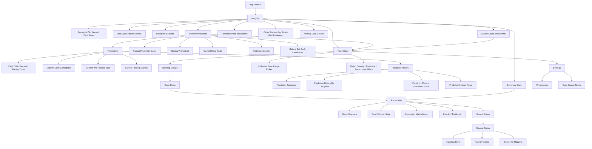
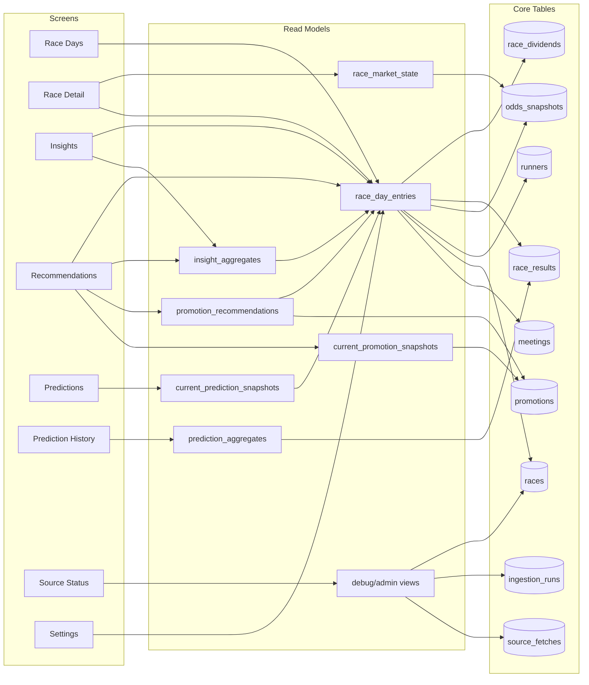

# Information Architecture

## Context

This document defines the MVP information architecture for the Feeling Gamba
Expo app. The app should help users browse recorded race outcomes, review
source-backed promotion signals, and help a developer/operator understand
whether ingestion is healthy.

The canonical structured source for this IA is:

- `docs/architecture/information-architecture.yaml`

The rendered visual representation is:

- `docs/architecture/information-architecture.html`
- `docs/architecture/information-architecture.png`
- `docs/architecture/information-architecture.jpg`

Note: the IA was updated on 2026-08-31 so NRL Insights include fixed-win
other-team price and favourite-vs-other price-difference breakdowns, and UFC
same-card multi history cards display the fight-card date from the earliest
advertised leg start while retaining source-date filters and predicted-at
labels. It was updated on 2026-08-27 to show sport-specific current
prediction finalisation at 15 minutes before the first race, fight, or match
starts and to add generic current prediction view locks. Rendered IA outputs
should be regenerated from the YAML before being treated as current. It was
updated on 2026-08-25 so Insights includes an NRL sport option
that reads fixed-win single and try-scorer percentage rows from
`nrl_insight_aggregates`. It was updated on 2026-08-28 so NRL Insights can also
show Same Game % rows for the favourite team plus the two shortest-priced
favourite-team try scorers once player try-scorer prices are captured, with the
Same Game % section shown before the NRL singles sections. It was
updated again on 2026-08-28 so NRL Insights replaces fixed-win and same-game
team breakdowns with 50c fixed-win and try-scorer price bucket breakdowns.
Rendered IA outputs should be regenerated from the YAML before being treated as
current. It was
updated on 2026-08-24 so
Predictions and Prediction History use
the same Sport -> Singles/Multis -> Signal type -> Model structure, including
the `single_win_percentage_65_plus_v1` 65%+ win-rate single tracker and stored
UFC Singles -> Win % history. The YAML was previously updated on 2026-08-05 to
change racing percentage multi locking from a fixed 10:00am cutoff to the
current prediction snapshot's first eligible race start. Rendered IA outputs
should be regenerated from the YAML before being treated as current. It was
previously updated on 2026-07-24 to
rename Race Days to Historical
Data, add Racing/UFC sport toggles to Historical Data and Insights, and add the
UFC favourite price, other fighter price, and price-difference insight
breakdowns. It was also updated on 2026-07-24 to add the
`multi_win_percentage_60_plus_v1` and `multi_place_percentage_v1` Win % multi
models. It was previously updated on 2026-07-23 to split current Predictions
from Prediction History, separate current cash, win-percentage, and placing
prediction types, add the
`multi_win_percentage_65_plus_v1` model, and move history model selectors
beneath the history type selector. It was previously updated on 2026-07-17 for
signed-in win-percentage multi
recommendation locks and rank-filtered win-percentage multi-bet performance,
on 2026-07-09 for a dedicated win-percentage multi-bet model and separate
performance/history sections, on 2026-07-07 for the Insights Win/Place tab
split and cash-only favourite place-return discipline metrics, on 2026-07-04
for tracked cash-only multi bet recommendation history, on 2026-07-03 for the
Predictions history date-range breakdown, on 2026-07-02 for the Predictions
multi bet recommendation panel, and on 2026-07-01 for HK domestic-region
prediction and race-day coverage. It was previously updated on 2026-06-25 for the two
cash-only prediction variations that isolate 100% price-bucket and 100%
starter-count scoring.
Rendered IA outputs should be regenerated from the YAML before being treated as
current.

## Principles

- Start with logged race data and source-backed promotion facts, not stake advice.
- Make country, date, discipline, and racecourse the primary browsing controls.
- Show missing market/result data explicitly rather than inventing values.
- Keep source/debug information available without making it the main user flow.
- Treat Australian and Hong Kong coverage as visible comparison data in Race
  Days, Insights, and bet-back candidate scans, with country labels available in
  app filters.
- Use Supabase app-facing read models for runtime race and insight data; local
  fixtures are development/backfill inputs only.
- Race Days and Insights course filters should be populated from Supabase rows
  produced by all-domestic AUS/NZ/HK race-day ingestion, not from a hardcoded
  app track list.
- User-specific features should start behind Supabase Auth with Google sign-in,
  then add row-level-secured favourite tracks and personal race logs.

## Primary Navigation

### Historical Data

Secondary browsing screen for the MVP. Historical Data is useful for historical
inspection but should not be the default app landing page.

Purpose:

- Toggle between Racing, PFL, and UFC historical rows.
- Toggle between raw Historical rows and generated Model backtests.
- Browse races by date.
- Filter by collected date range, country, discipline, and racecourse.
- Compare declared field size, final starter count, favourite, MarketMover,
  result, and payout/dividend data.
- Load the latest 20 races across AUS/NZ/HK by default and query Supabase for
  filtered sets when the user changes date, country, discipline, or course.
- Browse PFL and UFC fights by event-date range with fighter names, winner, favourite,
  favourite price, other fighter price, price difference, source match status,
  and `$1` favourite return state.
- Compare aggregate historical win-percentage multi backtests generated from
  prior-day-only data. These answer what the app would have recommended
  historically and remain separate from live Prediction History.

Main content:

- Sport selector: Racing, PFL, or UFC.
- View selector: Historical rows or Model backtests.
- Date range picker bounded to collected race/PFL/UFC event dates for Historical
  rows only. It keeps adjacent-day arrows, lets the user tap a date label to
  open a three-column scrolling day/month/year selector bounded to available
  dates, and includes quick presets for today, yesterday, last 7 available
  dates, and all available dates.
- Default latest-20-race Supabase result set across AUS/NZ/HK.
- Country filter: all countries, NZ, AUS, HK.
- Discipline filter: horse, harness, greyhound.
- Racecourse filter scoped by the selected country.
- Saved-track quick filter for signed-in users, applying country, discipline,
  and racecourse in one action.
- Favourite-track save/remove control when one country, discipline, and
  racecourse are selected.
- Race list grouped by meeting/track.
- UFC fight list grouped by returned event-date order.
- Model backtests view showing one top-level History type (`Win % multis`),
  sport-scoped model tabs, win percentage multi rank filters (`All legs`, `Top
  3`, `Top 4`), and aggregate Multi-bet win percentage performance. It does not
  show individual historical multi rows or a date selector for now.
- Empty and partial-data states.

Entry points:

- Main navigation from Insights.
- Date changes.
- Filters from Insights.

### Race Detail

Purpose:

- Explain one race outcome clearly.
- Show how favourite and MarketMover were selected.
- Show final results and dividends.

Main content:

- Race summary: track, race number, race name, start time, code, status.
- Field summary: declared runners, starters, scratchings.
- Market summary: selected favourite, MarketMover, snapshot timestamp, source.
- Result summary: winner, favourite placing, MarketMover placing, dividends.
- Runner table: runner number, name, scratched state, price, favourite/MM flags,
  finish position, win/place dividends.
- Source status: successful and failed fetches relevant to this race.

Entry points:

- Race list row.
- Favourite or MarketMover summary row from Insights.
- Operator/debug source mapping.

### Account

Purpose:

- Sign in with Google through Supabase Auth.
- Show the current signed-in email or display name.
- Sign out of the persisted Supabase session.
- Manage saved favourite tracks.
- Review manually tracked promo-bet performance.
- Maintain a manual personal balance ledger.

Main content:

- Google sign-in action.
- Signed-in identity.
- Sign-out action.
- Current manual balance card.
- Initial balance setup when no balance account exists.
- Deposit, withdrawal, and manual balance update controls.
- Balance history line graph built from stored balance events.
- Recent balance event list with event type, balance delta, balance after, and
  optional note.
- Favourite-track list with remove actions.
- Tracked promo-bet summary: logged count, settled count, pending count, and
  missing-outcome count.
- TAB/Betcha scope toggle for tracked promo-bet history and statistics.
- Tracked promo-bet return by discipline: cash average, cash net, bonus
  average, cash-plus-bonus average, cash-plus-bonus net, and ROI, calculated
  from settled rows only.
- Recent tracked promo-bet list with remove actions.
- Auth error state.

Auth notes:

- Expo uses the custom redirect scheme `feelinggamba://auth/callback`.
- Supabase Auth must allow that redirect URL in addition to local web URLs used
  during Expo web testing.

### Insights

Purpose:

- Act as the default app landing page for the MVP.
- Provide basic performance summaries without making predictions or
  recommendations.
- Show favourite-performance statistics across the collected historical dataset
  for thoroughbred, harness, and greyhound races.
- Toggle between Racing, NRL, PFL, and UFC insight views.
- Break favourite finish-position rates down by final starter count.
- Break favourite win percentage down by 50c fixed-win price bucket.
- Break favourite performance down by the average fixed-win price of the other
  priced starters.
- Show notional `$1` favourite return metrics by racing discipline.
- Show cash-only `$1` favourite place-return metrics by racing discipline,
  separate from bonus-bet credit and cash-plus-bonus value.
- Split Insights statistics into Win and Place tabs below the discipline
  filter, so win-return and place-return metrics are not mixed in one stack.
- Filter the `$1` favourite return by discipline, starter-count breakdown,
  favourite price breakdown, and other-starters average fixed-win breakdown by
  all countries or one selected country, then by all tracks or one selected
  track inside that country.
- When one track and one discipline are selected, allow an on-demand public odds
  request for all races at that track so account-visible hidden promos can be
  compared manually.
- Read stored Supabase aggregates rather than calculating historical insight
  tables in the app.
- For NRL, show fixed-win single aggregates, try-scorer percentage aggregates,
  fixed-win favourite price, other-team price, price-difference, and try-scorer
  price bucket aggregates, plus Same Game % aggregate rows from
  `nrl_insight_aggregates`.
- For UFC, show favourite price breakdown, other fighter price breakdown, and
  price-difference breakdown from `ufc_insight_aggregates`.
- For PFL, show the same fixed-win favourite price, other fighter price, and
  price-difference breakdowns from `pfl_insight_aggregates`.

Main content:

- Sport selector: Racing, NRL, PFL, or UFC.
- Date range filter.
- Country, discipline, and racecourse filters.
- Track scope filter: all tracks at the all-country level, or all tracks plus
  individual tracks with collected data after a country is selected.
- Saved-track quick filter for signed-in users, applying one stored country,
  discipline, and track scope.
- Favourite-track save/remove control when one country, discipline, and track
  scope are selected.
- On-demand track-race odds panel, visible only for one selected track.
- Default to the full collected date range.
- Separate discipline sections for thoroughbred, harness, and greyhound.
- Favourite win/place outcomes.
- Favourite win, 2nd, and 3rd percentages.
- `$1` unit-stake return metrics: total staked, total returned, net return,
  average return, bonus average, cash-plus-bonus average, and ROI.
- `$1` place unit-stake return metrics: place-eligible staked, cash returned,
  place hit rate, cash average, cash net, cash ROI, and missing place-dividend
  count.
- Win tab starter-count breakdown, for example 7 starters, 8 starters, 9
  starters, with win rate, finish-position rates, cash return, and
  cash-plus-bonus context.
- Win tab favourite price breakdown, for example `$1.00-$1.49`,
  `$1.50-$1.99`, and onward, with win rate and cash return.
- Place tab starter-count breakdown with place hit rate, cash average, cash
  net, cash ROI, and missing place-dividend counts.
- Place tab favourite price breakdown with place hit rate, cash average, and
  cash net.
- Other-starters average fixed-win breakdown, for example `$3.00-$5.99`,
  `$7.00-$9.99`, and `$25.00+`. These buckets use the average fixed-win price
  of priced non-favourite starters, with `$70.00+` prices excluded from the
  stored average.
- UFC favourite price, other fighter price, and price-difference breakdowns.
- NRL fixed-win favourite, home/away, 50c fixed-win price bucket, and round
  breakdowns.
- NRL try-scorer percentage summaries by player, team, and 50c captured
  try-scorer price bucket.
- NRL Same Game % summary and round breakdowns for the favourite-team plus
  top-two try-scorer model. Rows stay empty or `missing_price` until
  source-backed player try-scorer prices are captured. Show this section before
  the NRL fixed-win and try-scorer singles sections.
- MarketMover outcomes where available.
- Denominator counts for every percentage.
- Missing-data counts.
- Track-race odds response: runner number, runner name, fixed-win price,
  favourite flag, MarketMover flag, starter count, race status, and fetched
  timestamp.
- Track-race favourite context matching the default Betcha bet-back candidate
  model:
  implied win percentage, favourite price bucket, historical price bucket,
  starter bucket, default cash average score, blended cash-plus-bonus average,
  sample size, and signal text.
- Links back to filtered Race Days and Race Detail screens.

Entry points:

- App launch.
- Main navigation.

MVP limits:

- No stake sizing.
- No bankroll guidance.
- No automated wagering.
- No account credential storage or automated access to personalised promo
  surfaces.
- Push notifications are limited to neutral finalised-model alerts for
  user-favourited prediction models with active current predictions.

### Recommendations

Purpose:

- Show current public TAB and Betcha race-specific promotion signals.
- Keep all fetched public promotions available for source diagnostics, while
  hiding broad unmatched racing offers from the normal frontend list.
- Match race-specific promotions to current race cards.
- Show current favourite, fixed-win price, starter count, and MarketMover where
  available.
- Compare current race facts with historical starter-count and price-bucket
  statistics.
- Surface statistical signals without stake sizing or automated wagering.

Main content:

- Provider/source labels.
- Supabase cache/source status.
- Racing promotion cards.
- Current race-card facts: race, start time, starter count, favourite,
  fixed-win price, MarketMover, and promo target runner where available.
- Starter-count historical signal.
- Price-bucket historical signal.
- Cash-plus-bonus average and starter-bucket metrics for race-specific
  promotion signals.
- Track-bet control on visible promo race signals for signed-in users, storing
  one owner-secured personal race record per bookmaker without stake sizing.
- Track-bet control should show an unavailable runner state, not a sign-in
  prompt, when the user is signed in but the payload has no trackable runner.
- Bookmaker scope inferred from the visible promo source: TAB promos track as
  TAB and Betcha promos track as Betcha.
- Cache age, stale-cache warning, and a Refresh control for requesting fresh
  promotion recommendations when a backend refresh endpoint is configured.
- Historical signal basis label showing the stored Supabase insight aggregate
  rows used by the payload.
- Missing-price state when fixed-win prices are unavailable.
- Unavailable state when Supabase promotion configuration, cache rows, or cache
  reads are missing; the screen must not fall back to bundled promotion JSON.

MVP limits:

- No stake sizing.
- No bankroll guidance.
- No automated connection to bookmaker balances.
- No automated wagering.
- No invented prices or favourites.

### Predictions

Purpose:

- Show current ranked sport-specific prediction signals from the latest stored
  current prediction source.
- Split current prediction branches so sport, single/multi format, cash-return,
  win-percentage, and placing signals are not mixed in one stack.
- Keep current race-card facts and current recommendations separate from stored
  historical outcome performance.

Main content:

- Shared prediction hierarchy: Level 1 sport tabs (`Racing`, `NRL`, `UFC`);
  Level 2 format tabs (`Singles`, `Multis`); Level 3 signal tabs (`Cash`,
  `Win %`, `Placing`); Level 4 model tabs filtered to the selected
  sport/format/signal.
- Cash prediction model selector and method summary for cash-model candidates.
  Racing Singles -> Cash and Racing Multis -> Cash expose the same cash model
  list: `Global bucket blend`, `Global cash bucket blend`, `Global cash 50/50
  blend`, `Global cash price only`, `Global cash starters only`, `Other starters
  avg price`, `Country + discipline blend`, and `Distance + condition blend`.
- Cash model `Bet candidates` section for the current Auckland source date's
  candidate snapshot. Under Singles it shows ranked individual candidates; under
  Multis it shows only the current active-model multi bet recommendation.
- Current bet candidates grouped by discipline, with favourite, fixed-win price,
  active model score, estimated cash return per `$1`, price bucket, starter
  bucket, other-starters average fixed-win price, MarketMover, and manual track
  action.
- Race recommendation rows should show a compact horse, harness, or greyhound
  discipline icon beside the race title/runner line.
- Multi bet recommendation panel derived from the current candidate snapshot:
  if at least two active-model Positive signals exist, show a Positive multi;
  otherwise show a Neutral multi from active-model Positive and Neutral signals
  when at least two priced legs are available.
- Win percentage singles panel shown under Racing -> Singles -> Win % for
  `single_win_percentage_60_plus_v1` and `single_win_percentage_65_plus_v1`,
  listing every current favourite whose blended historical win score is at
  least the selected threshold as a separate tracked `$1` single.
- NRL Singles -> Win % reads `nrl_single_predictions` and shows fixed-win
  percentage and try-scorer percentage model tabs. Fixed-win percentage rows
  use current market favourites; try-scorer percentage rows use official
  historical player/team try rates and are labelled as historical roster
  candidates until current lineups are validated.
- Percentage multi recommendation panel shown under Racing -> Multis -> Win %.
  Win-rate models use 65% favourite price-bucket win rate and 35%
  starter-count win rate. The placing model uses 65% favourite price-bucket
  place rate and 35% starter-count place rate, excludes races without an active
  place market, and does not show place-multi payout odds.
- Sport selector for current Predictions: Racing, NRL, PFL, or UFC.
- Racing prediction type selector: Cash, Win %, and Placing.
- Racing Win percentage type selector with the original `multi_win_percentage_blend_v1`
  two-to-five leg model and stricter `multi_win_percentage_60_plus_v1` and
  `multi_win_percentage_65_plus_v1` models that keep only 60%+ or 65%+
  win-score legs using the 65/35 blend, plus
  `multi_win_percentage_50_50_65_plus_v1` for a 50/50 price-bucket and
  starter-count 65%+ threshold. Threshold models can generate with a minimum
  of two legs and show up to 10 legs, plus
  `multi_place_percentage_v1` with up to eight place-rate legs.
- UFC Win percentage model selector with same-card percentage multi models for
  favourite price bucket, other fighter price bucket, and price-difference
  bucket signals; each UFC model can show up to eight Head to Head favourite
  legs from one Betcha UFC card.
- UFC Singles -> Win % shows dedicated `65%+ win singles`, `75%+ win
  singles`, and `85%+ win singles` model tabs alongside the existing UFC favourite-price,
  other-fighter-price, price-difference, and price-difference 75%+ single model
  tabs. The broad threshold models list fully priced Head to Head favourites
  whose strongest UFC historical win-percentage signal is at least the selected
  threshold; the price-difference 75%+ model uses only the price-difference
  bucket signal. Current UFC single candidates are grouped by fight night so
  separate cards do not interleave in the list.
- UFC exposes the same sport/format/signal hierarchy as Racing. Unsupported
  UFC branches, such as non-Win % signal types, show explicit empty states until
  matching models are added.
- PFL exposes the same sport/format/signal hierarchy and Win % model tab shape
  as UFC. Current PFL Win % tabs show candidates only when current fixed-win MMA
  odds match the reviewed PFL event allow-list by event date and fighter pair;
  unsupported PFL signal types remain explicit empty states.
- NRL exposes the same sport/format/signal hierarchy as Racing. Unsupported NRL
  branches, such as cash, placing, and multis, show explicit empty states until
  matching cash or same-game models are added.
- The current Predictions refresh button refreshes only the active sport:
  Racing refreshes racing race-card predictions; UFC refreshes UFC fight-card
  multis without refreshing racing; PFL refreshes reviewed current PFL
  fixed-win candidates without refreshing racing or UFC.
- UFC percentage multis can be locked per signed-in user, source date, card,
  and model until the stored card cutoff just before the first fight. They do
  not use the racing first-eligible-race lock rule.
- Placing recommendations panel shown under the placing type,
  using historical place percentages from stored insight aggregates. A place
  counts as top 2 in smaller place fields and top 3 in larger fields: AU/NZ
  uses 5-7 starters for top 2 and 8+ for top 3; HK uses 4-6 starters for top 2
  and 7+ for top 3. Smaller fields with no place market are excluded. Current
  placing recommendation cards should show place score, place cash average
  score, favourite price bucket, and starter-count bucket context.
- Bet candidate disciplines should be shown as tabs for horse, harness, and
  greyhound in the cash type so users can scan one ranked discipline list at a
  time on mobile.
- Candidate status pills should include the active model's cash metric basis,
  such as `Positive cash blend` or `Weak price cash`, so users do not compare
  different cash formulas as if they were the same signal.
- A compact signal guide should appear above the candidate cards and explain
  the active prediction model's cash-score formula plus `Positive`, `Neutral`,
  `Weak`, `Small sample`, and `Limited history` meanings.
- Candidate bucket details should label cash average and cash-plus-bonus average
  separately so supporting bonus context is not mistaken for the recommendation
  score.
- Current bet candidates must come from the current Auckland source date's
  pre-finalisation prediction snapshot. If the sport-specific finalisation
  cutoff has passed and no same-day snapshot was captured, show an explicit
  closed-window empty state instead of displaying an older source date.
- Current bet candidates and multi bet recommendations must exclude source
  races marked abandoned or cancelled by the race listing or race-card status.
- If a stored current prediction snapshot exists and its prediction window is
  already closed, render the cached snapshot immediately instead of attempting a
  stale-cache refresh that cannot replace the finalised snapshot.
- Current bet candidates should be ordered by the active prediction variation's
  model-specific `cashAverageScore`. Cash-plus-bonus remains visible as
  supporting context but must not drive recommendations.
- Prediction variation tabs, starting with `Global bucket blend`,
  `Global cash bucket blend`, `Global cash 50/50 blend`,
  `Global cash price only`, `Global cash starters only`,
  `Other starters avg price`, `Country + discipline blend`, and
  `Distance + condition blend`.
- Prediction variation tabs should show a small `Multi` tag when that model has
  at least one tracked multi-bet prediction row for the current Auckland source
  date.
- Show a visible `Prediction finalises before ...` status near the top of
  Predictions, calculated as 15 minutes before the selected sport's first race,
  fight, or match starts.
- Signed-in users should be able to lock the current selected
  sport/format/type/model prediction view before that sport's finalisation
  cutoff. Existing percentage multi locks continue to display user-owned
  snapshots for the current source date/model instead of later live
  recommendation changes.
- Lock actions should show or sit near the cutoff timestamp so users can see
  when each current recommendation or view stops being lockable.
- Signed-in users should be able to favourite the selected prediction model for
  mobile notifications. The control should save the exact sport/format/type/model
  branch and alert only after the model finalises with active current
  predictions.
- A method summary at the top of each prediction variation explaining how the
  candidates are scored and how current cards are ordered.
- `Global cash bucket blend` should score candidates as 65% favourite
  price-bucket cash average plus 35% starter-count cash average, excluding
  bonus-credit value.
- `Global cash 50/50 blend` should score candidates as 50% favourite
  price-bucket cash average plus 50% starter-count cash average, excluding
  bonus-credit value.
- `Global cash price only` should score candidates as 100% favourite
  price-bucket cash average, excluding bonus-credit value.
- `Global cash starters only` should score candidates as 100% final
  starter-count cash average, excluding bonus-credit value.
- `Other starters avg price` should score candidates as 100% of the matching
  other-starters average fixed-win price bucket's cash average. Other-starter
  prices at `$70.00` or above are excluded from the average and counted
  separately. Median other-starter fixed-win price remains a planned follow-up
  signal.

Rules:

- Read current bet candidates from the latest Supabase
  `current_prediction_snapshots` payload for the current Auckland source date.
- Show the current multi bet recommendation from the active-model
  current-candidate payload, while storing the same pre-race recommendation
  server-side for cash-only history and settlement.
- Exclude abandoned or cancelled races before ranking candidates, building
  current multis, or writing tracked multi-bet recommendations.
- Do not include bonus-bet value in tracked multi recommendation stats.
- Do not create or store new current prediction rows after the selected sport's
  standard finalisation cutoff has passed.
- Treat other-starters average fixed-win price as a statistical field-shape
  signal, not certainty about race strength.
- Keep the screen as statistical tracking only: no stake sizing, bankroll
  guidance, or automated wagering.

### Prediction History

Purpose:

- Compare stored predictions with settled race outcomes after race-day refreshes.
- Show prediction performance using the same notional `$1` cash-plus-bonus
  return metrics used by Insights.
- Let prediction variations run in parallel and compare performance without
  mixing their denominators.
- Keep itemised historical prediction rows out of the current Predictions tab.

Main content:

- Shared prediction hierarchy matching the current Predictions page: Level 1
  sport tabs (`Racing`, `UFC`); Level 2 format tabs (`Singles`, `Multis`);
  Level 3 signal tabs (`Cash`, `Win %`, `Placing`); Level 4 model tabs filtered
  to the selected sport/format/signal.
- Model selectors sit beneath the sport/format/signal controls: cash prediction
  model tabs for Racing Cash singles and multis, the `60%+ win singles` and
  `65%+ win singles` models for Racing Singles -> Win %, percentage multi model
  tabs for Racing Multis -> Win %, the place percentage multi model for Racing
  Multis -> Placing, and UFC same-card percentage multi models for UFC Multis
  -> Win %.
- Stored model performance section for historical outcomes, discipline
  performance, date-range breakdowns, and prediction history.
- Overall prediction count, settled count, pending count, and missing-outcome
  counts, shown near the top under a `Single prediction performance` heading.
- Stored model performance filters for all/horse/harness/greyhound,
  all/top 1/top 2/top 3 ranks, and all/positive-only/neutral-or-better signals.
  `Neutral or better` includes only Positive and Neutral candidate signals,
  excluding Small sample and Limited history.
- Discipline prediction performance by racing code.
- Cash average, cash net, bonus average, cash-plus-bonus average,
  cash-plus-bonus net, cash ROI, and cash-plus-bonus ROI for each discipline,
  with average returns displayed as dollar value per `$1` prediction.
- Placing prediction performance should include place rate, place cash average,
  place cash net, position split, place-market rule, missing place-dividend
  count, and open issues.
- Recent prediction history showing each stored race prediction, predicted
  runner, predicted price, race details, outcome status, and cash/bonus return.
- UFC same-card multi history cards show the earliest advertised leg start date
  under the event heading, while date filters continue to use the prediction
  source date and the footer keeps the predicted-at timestamp.
  Outcome badges should distinguish cash wins from bonus-bet credits: win
  returns use the positive cash style, while 2nd/3rd bonus-credit outcomes use
  a bonus-bet style and should not be labelled as generic value.
- Prediction history rows should be ordered by outcome before time: wins first,
  then 2nd, then 3rd, then other settled losses, then unresolved rows.
- Prediction history filters for date range, country, discipline, and
  racecourse. These filters apply only to the itemised history list, not the
  aggregate performance cards. Country, discipline, and racecourse options are
  scoped to the selected prediction model so filters do not appear for models
  with no matching stored rows.
- Prediction history date range should default and reset to yesterday in
  `Pacific/Auckland` time, even if no prediction rows exist for that date yet.
- Prediction history date range controls should keep adjacent-day arrows, let
  the user tap a date label to open a three-column scrolling day/month/year
  selector bounded to available prediction dates, and include quick presets for
  today, yesterday, last 7 available dates, and all available dates.
- Date range breakdown for the selected Prediction history filters, using the
  same prediction count, settled/pending count, win rate, cash average, cash
  net, cash-plus-bonus average, cash-plus-bonus net, and open-issue metrics as
  the stored model performance cards.
- Multi-bet prediction performance in the Stored model performance section
  for the selected prediction model across all tracked dates, using cash-only
  multi-bet prediction count, settled/pending count, win rate, cash average, cash net,
  and open-issue metrics.
- Multi-bet percentage performance in Stored model performance, independent of
  the selected cash prediction model, using the selected percentage multi model,
  tracked multi count, settled/pending count, hit rate, relevant average score,
  cash average, cash net, and open-issue metrics. For
  `multi_place_percentage_v1`, cash return metrics use stored fixed-place odds
  where available. Signed-in users with locked racing percentage multis see
  their own locked multi outcomes for the selected model/date range; users with
  no matching locks continue to see the shared tracked recommendation history.
- Prediction History sport selector: Racing, NRL, PFL, or UFC. UFC uses the same
  hierarchy and has stored history under Singles -> Win % and Multis -> Win %.
  UFC Singles -> Win % reads `ufc_single_predictions` through UFC-specific
  summary/history RPCs and hides racing-only country, discipline, and
  racecourse filters. UFC single history includes the bucket models plus the
  `65%+`, `75%+`, `85%+`, and price-difference `75%+` threshold single models.
  PFL history uses the same visible Singles/Multis -> Win % tab structure as
  UFC but remains an explicit reserved state until PFL prediction storage/RPCs
  exist, even though current
  PFL predictions can appear in the latest mixed snapshot. NRL history branches
  show explicit empty states until NRL prediction reconciliation and history
  RPCs are added.
- Multi-bet percentage performance should include a local rank filter just
  above that performance section. It always includes All legs, then exposes
  top-N options up to the selected model's configured maximum: top 2-5 for the
  original win-percentage model, top 2-10 for the racing threshold
  win-percentage models including `multi_win_percentage_50_50_65_plus_v1`, top
  2-8 for `multi_place_percentage_v1`, and top 2-8 for UFC percentage multi
  models.
  Filtered rows should re-aggregate the first ranked percentage multi legs from
  each stored recommendation instead of reusing the full stored multi result.
- Placing prediction performance in Stored model performance for the selected
  model, using place-eligible settled rows and country-aware starter-count place
  rules instead of raw 1st/2nd/3rd totals.
- Multi bet date-range breakdown for the selected prediction model using the
  same cash-only metrics and the active Prediction history filters.
- Percentage multi date-range breakdown and history using the active Prediction
  history filters, with average win score or place score labels instead of
  average cash score labels. UFC percentage multi history uses date filters
  only and hides racing-only country, discipline, and racecourse filters.
- Multi bet recommendation history rows showing recommendation type, leg count,
  relevant average score, combined win/place odds, cash return, result label,
  and leg-level Won/Placed/Lost/Missed/Pending/Missing outcomes.
- Explicit empty/loading/error states when Supabase prediction aggregates are
  unavailable.

Rules:

- Read stored `prediction_aggregates` and recent `promotion_predictions` rows
  from Supabase filtered by the selected prediction model.
- Treat the selected prediction model tab as the single driver for the
  cash-model historical sections: stored performance, history metadata, history
  summaries, history rows, selected-model multi performance, and selected-model
  multi history must all be scoped to the active model key.
- Percentage multi history uses the selected sport's dedicated multi-only
  model,
  starting with `multi_win_percentage_blend_v1`,
  `multi_win_percentage_60_plus_v1`, `multi_win_percentage_65_plus_v1`, and
  `multi_place_percentage_v1` for Racing, or the UFC favourite price, other
  fighter price, and price-difference multi models for UFC, independent of the
  selected cash model.
- Do not calculate prediction performance from raw prediction rows in the app.
- Use raw prediction rows only for server-side filtered itemised history
  display.
- Summarise Prediction history date ranges through a server-side aggregate RPC
  over all matching rows, not from the paginated visible history list.
- Use the predicted runner and predicted fixed-win price when calculating
  outcomes, not the final favourite if it changed later.
- Keep the screen as statistical history only: no stake sizing, bankroll
  guidance, or automated wagering.

### Source Status

Developer/operator-focused area.

Purpose:

- Explain ingestion health and data completeness.
- Help identify parser/source failures.

Main content:

- Ingestion run list.
- Failed fetch list.
- Race source ID mapping.
- Missing market/result data report.
- Manual date/race inspection links.

MVP access:

- Can start as a hidden/debug screen or Supabase table view.
- Should not be the primary app experience for normal users.

### Settings

Purpose:

- Keep lightweight app preferences and data-source context.

Main content:

- Default racing code.
- Default racecourse filter.
- Data-source notes.
- App/version metadata.

## App Map

```mermaid
flowchart TD
  launch[App Launch] --> insights[Insights]

  insights --> summaryStats[Summary Stats]
  insights --> favFinish[Favourite Win Second Third Rates]
  insights --> returnStats[Unit Stake Return Metrics]
  insights --> disciplineStats[Discipline Sections]
  insights --> starterBreakdown[Starter Count Breakdown]
  insights --> priceBreakdown[Favourite Price Breakdown]
  insights --> otherPriceBreakdown[Other Starters Avg Fixed-Win Breakdown]
  insights --> missingData[Missing Data Counts]
  insights --> recommendations[Recommendations]
  insights --> raceDays[Race Days]

  recommendations --> promoCards[Racing Promotion Cards]
  recommendations --> racingPromoList[Racing Promo List]
  recommendations --> currentRaceFacts[Current Race Facts]
  recommendations --> promoSignals[Historical Signals]
  recommendations --> betBackCandidates[Betcha Bet-Back Candidates]
  recommendations --> predictions[Predictions]
  recommendations --> raceDays

  predictions --> predictionTypes[Cash / Win Percent / Placing Types]
  predictions --> currentCandidates[Current Cash Candidates]
  predictions --> currentWinMulti[Current Win Percent Multi]
  predictions --> currentPlacing[Current Placing Signals]
  predictions --> predictionHistory[Prediction History]

  predictionHistory --> predictionSummary[Prediction Summary]
  predictionHistory --> predictionReturns[Prediction Return By Discipline]
  predictionHistory --> predictionMissing[Pending / Missing Outcome Counts]
  predictionHistory --> predictionRows[Prediction History Rows]

  raceDays --> datePicker[Collected Date Range Picker]
  raceDays --> filters[Date / Country / Discipline / Racecourse Filters]
  raceDays --> meetingGroups[Meeting Groups]
  meetingGroups --> raceRows[Race Rows]
  raceRows --> raceDetail[Race Detail]

  raceDetail --> raceOverview[Race Overview]
  raceDetail --> fieldState[Field / Starter State]
  raceDetail --> marketState[Favourite / MarketMover]
  raceDetail --> resultState[Results / Dividends]
  raceDetail --> sourceState[Source Status]

  summaryStats --> raceDetail
  starterBreakdown --> raceDays

  sourceState --> sourceStatus[Source Status]
  sourceStatus --> ingestionRuns[Ingestion Runs]
  sourceStatus --> failedFetches[Failed Fetches]
  sourceStatus --> sourceMapping[Source ID Mapping]

  raceDays --> settings[Settings]
  settings --> preferences[Preferences]
  settings --> dataNotes[Data Source Notes]
```

## Primary User Flow

```mermaid
flowchart LR
  A[Open app] --> B[Review insights]
  B --> C[Review favourite win / 2nd / 3rd rates]
  C --> D[Open recommendations]
  D --> E[Review current promotion signals]
  E --> F[Review unit stake returns by discipline]
  F --> G[Drill into starter count breakdown]
  G --> H[Open Race Days when needed]
  H --> I[Filter date / discipline / racecourse]
  I --> J[Scan race list]
  J --> K[Open race detail]
  K --> L[Check favourite, placing, and dividends]
  L --> M[Return to insights or adjust filters]
```

## Screen And Data Relationships

```mermaid
flowchart LR
  subgraph screens[Screens]
    raceDays[Race Days]
    raceDetail[Race Detail]
    insights[Insights]
    recommendations[Recommendations]
    predictions[Predictions]
    predictionHistory[Prediction History]
    sourceStatus[Source Status]
    settings[Settings]
  end

  subgraph views[Read Models]
    raceDayView[race_day_entries]
    marketState[race_market_state]
    insightView[insight_aggregates]
    promoCache[current_promotion_snapshots]
    predictionCache[current_prediction_snapshots]
    predictionView[prediction_aggregates]
    promoView[promotion_recommendations]
    debugViews[debug/admin views]
  end

  subgraph tables[Core Tables]
    meetings[(meetings)]
    races[(races)]
    runners[(runners)]
    snapshots[(odds_snapshots)]
    results[(race_results)]
    dividends[(race_dividends)]
    promotions[(promotions)]
    fetches[(source_fetches)]
    runs[(ingestion_runs)]
  end

  raceDays --> raceDayView
  raceDetail --> raceDayView
  raceDetail --> marketState
  insights --> insightView
  insights --> raceDayView
  recommendations --> promoCache
  recommendations --> promoView
  recommendations --> insightView
  recommendations --> raceDayView
  predictions --> predictionCache
  predictionHistory --> predictionView
  sourceStatus --> debugViews
  settings --> raceDayView

  raceDayView --> meetings
  raceDayView --> races
  raceDayView --> runners
  raceDayView --> snapshots
  raceDayView --> results
  raceDayView --> dividends
  insightView --> raceDayView
  promoView --> promotions
  promoView --> raceDayView
  promoCache --> promotions
  predictionCache --> raceDayView
  predictionView --> results

  marketState --> snapshots
  debugViews --> fetches
  debugViews --> runs
  debugViews --> races
```

## MVP Screen Inventory

| Screen | Primary user | MVP priority | Notes |
| --- | --- | --- | --- |
| Insights | App user | Required | Default app screen; favourite win/2nd/3rd rates over the collected date range, country/track-filtered unit-stake returns by discipline, starter-count breakdowns, price-bucket breakdowns, and other-starters average fixed-win breakdowns. |
| Recommendations | App user | Required | Source-backed promotion signals using TAB/Betcha promotions, current race facts, and historical buckets; no staking advice. |
| Predictions | App user | Required | Current prediction signals split by Cash, Win %, and Placing types; no settled history list. |
| Prediction History | App user | Required | Stored single-prediction, multi-bet, percentage multi, and placing performance/history. |
| Race Days | App user | Required | Secondary historical browsing screen with date, country, discipline, and racecourse filters. |
| Race Detail | App user | Required | Must make source and missing data clear. |
| Source Status | Developer/operator | Required for MVP operations | Can start hidden or as a debug/admin view. |
| Settings | App user | Useful | Keep minimal until product behaviour expands. |

## Content Rules

- Race list rows should show missing favourite, MarketMover, result, or dividend
  data as explicit unavailable states.
- Race Days should remain a separate page from Insights and provide date,
  country, discipline, and racecourse filters. It should load the latest 20
  races across AUS/NZ/HK from Supabase by default, then query Supabase with
  selected filters.
- Race Detail should show the snapshot timestamp used for favourite/MM when the
  data came from pre-race odds.
- Result-page favourite rank and pre-race favourite are separate concepts.
- MarketMover should only appear when a source explicitly provides it.
- Favourite statistics should show win, 2nd, and 3rd percentages with
  denominator and missing-data counts.
- Favourite price breakdowns should use 50c fixed-win price ranges, such as
  `$1.00-$1.49` and `$1.50-$1.99`, and show selection counts beside win rates.
- Other-starters average fixed-win breakdowns should use
  `other_starters_average_price_bucket` aggregate rows and inherit the `$70.00+`
  outlier exclusion used by prediction models.
- Insight return tables should be filterable by all countries or one selected
  country, then by all tracks or one individual track inside the selected
  country, with the same metric definitions in each scope. They should read
  stored Supabase aggregates, not calculate historical tables from bundled
  fixtures in the app.
- Insight country and track filter options may be derived from any stored
  aggregate rows that carry `country`, `course_name`, and `course_slug`, so the
  controls remain available while older aggregate runs are missing direct
  country/course scope rows.
- Recommendations should show source-backed promotion details, current race
  facts, and historical statistical signals only.
- Recommendations must show missing prices/favourites explicitly and must not
  invent a favourite when fixed-win prices are unavailable.
- Recommendations must show the Supabase promotion snapshot's Auckland source
  date and stale/missing states.
- Recommendations must not include stake sizing, bankroll guidance, or
  automated wagering actions.
- Predictions bet candidates should be framed as ranked statistical candidates,
  not instructions to bet, and should use all NZ/AUS/HK domestic-region race
  cards returned by the source. They should be grouped by country and
  discipline with a maximum of five candidates per country/discipline group.
- Predictions percentage multi locking should remain a user-owned snapshot
  control only, with no stake size, bankroll advice, or automated wagering.
- Return metrics should show the outcome of a notional `$1` stake on each
  favourite, including total staked, total returned, net return, average return,
  ROI, and missing price counts.
- Insights should separate return and finish-position summaries by race code.
- Starter-count statistics should use final starters after scratchings.
- Source/debug data should explain confidence and failures without overwhelming
  the normal race browsing flow.

## Future IA Candidates

- Track detail pages.
- Runner history pages.
- Additional alert types, such as lead-time reminders or card-level alerts.
- Backfill/admin tools for operators.
- Authenticated or personalized promotion tracking if the product gains a clear
  use case and terms are confirmed.
